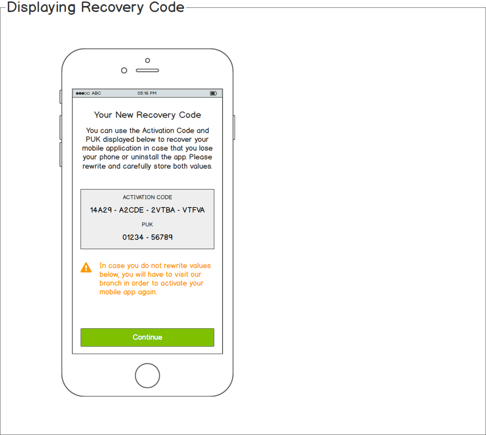
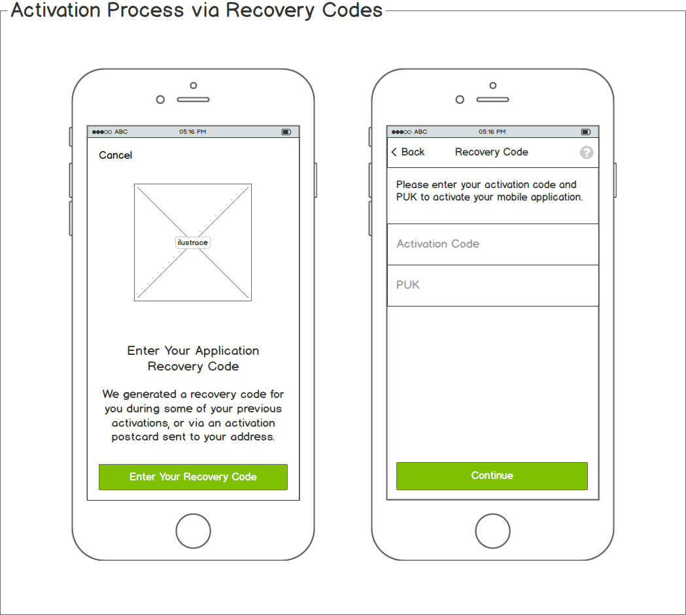
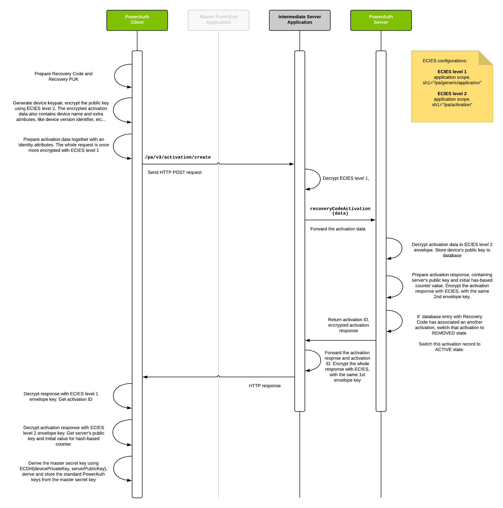

# Activation Recovery

The Activation via Recovery Code is a process allowing the user to self activate the PowerAuth powered application. Such recovery typically doesn't require support from Master Front-End Application (like internet banking) or doesn't need to be confirmed via another channel (like via SMS authorization code). This kind of activation is typically useful in case of emergency when the mobile device with an activated application is no longer in the user's possession.

This chapter of the documentation describes how this process works and what you should consider before you allow this feature in your application.

## Basic definitions

- **"Activation via Recovery Code"** (or recovery activation) – is a process allowing the user to self activate its PowerAuth powered mobile app via the "Recovery Code" and "Recovery PUK."

- **"Recovery Code"** – is a code required for the activation recovery. The purpose of this code is to identify the user on the server side. See [Format chapter](#format-of-recovery-code) at the end of document.

- **"Recovery QR Code"** – is a "Recovery Code" encoded into a QR code. The QR code contains additional information to distinguish the code from a regular activation code.

- **"Recovery PUK"** (or PUK) – is a "Personal Unblocking Key," 10 digits long number. The PUK acts as a one time password in the scheme. See [Format chapter](#format-of-recovery-puk) at the end of document.

- **"PUK Index"** – is a number, representing an order in which PUK codes should apply for a recovery activation.

- **"Recovery Postcard"** – is a printed postcard, delivered to the user via OOB channel (for example, via courier delivery). See [Recovery Postcard](Recovery-Postcard.md) for more details.

- **"Recovery Postcard Confirmation"** – is a process where the user confirms the issued postcard. The purpose of this process is to guarantee that the user really received the postcard and therefore the postcard can be used for the recovery operations in the future.

The Recovery Code and PUK can be obtained in two basic ways:

1. As a part of an application activation
   - In this case, only one pair of Recovery Code and PUK is generated.
   - This type of Recovery Code is associated to the activation and if it's used for the recovery, then the previous activation is removed.
   - This type of Recovery Code and PUK can be obtained via any type of the activation process.
   - See [Application provided Recovery Code and PUK](#application-provided-recovery-code-and-puk) chapter for more details.

1. Via the Recovery Postcard
   - Postcard typically contains one Recovery Code and multiple PUK values.
   - User has to use PUKs from postcard in the predefined order.
   - Each PUK can be used only once.
   - The Recovery Code must be confirmed before it can be used for a recovery.
   - See [Recovery Postcard](Recovery-Postcard.md) document for more details.


## Implications to security

The Activation via Recovery Code is by default **disabled** on PowerAuth Server. Before you [enable and configure](https://github.com/wultra/powerauth-admin/blob/develop/docs/Activation-Recovery.md#enabling-activation-recovery) this feature, you should read this chapter and decide, whether it is appropriate and safe for your purposes.

### Application is active from the beginning

If application is activated via the Recovery Code and PUK, then it goes immediately to **ACTIVE** state (see [Activation States](Activation.md#activation-states)). There's no intermediate state when the user can confirm that activation in the additional digital channel (like internet banking). This fact limits this feature mostly to only limited application scenarios:

1. Only for the application that doesn't provide active operations
2. The application itself acts as a confirmation device (like our [Mobile Token](https://www.wultra.com/mobile-token) does)

For the first case, we don't recommend to allow this feature for PowerAuth powered applications, that provide "active" operations. That's typically a mobile banking app that can withdraw money from user's account. The reason for that is that if the Recovery Code and PUK are compromised, then the attacker can easily harm the user.

In the second scenario, the mobile application acts as a replacement for a typical authorization channel, like SMS, or another hardware token. In this situation, compromising Recovery Code and PUK can be still very dangerous, but requires a more coordinated attack to harm the user. The attacker has to typically gain an access to additional credentials, like login and password to internet banking.

For all cases, we recommend you to implement the following countermeasures:

- Confirm the recovery activation with an [additional activation OTP](Additional-Activation-OTP.md).
- Your application should receive a push notification once the activation is recovered on another device.
- You should also notify the user via other digital channel, like SMS or e-mail.
- You should adequately inform the user about how sensitive Recovery Code and PUK are.


### Application provided Recovery Code and PUK

If the feature is enabled on the PowerAuth Server, then one pair of Recovery Code and PUK is generated during the activation process.



Because of the sensitivity of those values, you should adequately instruct your user that:

- Recovery Code and PUK are sensitive values, so the user should put both values on paper and keep it at a safe place.
- Your application should proactively disable screenshots when Recovery Code and PUK are visible on the screen. Alternatively, you should warn the user in case that user took the screenshot.

The [PowerAuth mobile SDK](https://github.com/wultra/powerauth-mobile-sdk) provides additional functionality that allows the user to display that values after the activation. In that case, you should apply the same rules as above when the values are visible on the screen.

### Protecting Recovery PUK

The Recovery PUK should not be stored in plaintext in the database. The current PowerAuth Server implementation uses [Argon2 password hashing algorithm](https://github.com/p-h-c/phc-winner-argon2) with the following configuration:

- `Argon2i`, Version=`0x13`
- Iterations = `3`
- Memory = `15` (in power of 2, so it will use 32MB of RAM)
- Parallelism = `16`
- Output length = `32`
- No "ad", No "secret"
- Random 8 bytes as salt
- Encoded to [Modular Crypt Format](https://passlib.readthedocs.io/en/stable/lib/passlib.hash.argon2.html#passlib.hash.argon2)
- It is possible to enable encryption of hashed passwords in the database. See [Encrypting Records in Database](https://github.com/wultra/powerauth-server/blob/develop/docs/Encrypting-Records-in-Database.md) documentation.

## Activation via Recovery Code and PUK

This chapter describes in detail how Activation via Recovery Code and PUK works.

### Activation User Flow

From the user's perspective, the Activation Flow via Recovery Code and PUK is very similar to a regular activation:

1. In the PowerAuth Client, user selects the "Activation via Recovery Code" option, in the activation wizard.

1. User scans "Recovery QR Code" or enters the code manually
   - It does not matter whether the code is on the postcard, or was created in the previously activated application.
   - Note that PowerAuth Client can detect typing errors in this step, due to checksum available in the [Recovery Code](#format-of-recovery-code).

1. User enters PUK in a separate screen
   - Typing errors cannot be detected here. User has several attempts to use one PUK.
   - If the information about the PUK Index is available due to previous failed attempt, then you can instruct the user, to re-type PUK at specific PUK Index.

After this step, PowerAuth Client performs Key Exchange with the PowerAuth Server, and the activation continues as usual. The only difference is that the activation is immediately in the "ACTIVE" state, so no activation commit is required.



### Key Exchange

Following diagram shows how public keys are exchanged between PowerAuth Client and PowerAuth Server, and how master shared secret and PowerAuth Standard Keys are derived. The process is very similar to [Key Exchange](Activation.md#key-exchange) from a regular [Activation](Activation.md).




### Activation Flow - Description

To describe the steps more precisely, the recovery activation process is performed in following steps:

1. PowerAuth Client collects `RECOVERY_CODE` and `RECOVERY_PUK` from the user.

1. PowerAuth Client generates its key pair `(KEY_DEVICE_PRIVATE, KEY_DEVICE_PUBLIC)`.
   ```java
   KeyPair keyPair = KeyGenerator.randomKeyPair()
   PrivateKey KEY_DEVICE_PRIVATE = keyPair.getPrivate()
   PublicKey KEY_DEVICE_PUBLIC = keyPair.getPublic()
   ```

1. PowerAuth Client encrypts payload containing `KEY_DEVICE_PUBLIC` with an application scoped ECIES (level 2, `sh1="/pa/activation"`). Let's call the result of this step as `ACTIVATION_DATA`.

1. PowerAuth Client encrypts payload containing `ACTIVATION_DATA`, `RECOVERY_CODE` and `RECOVERY_PUK` with an application scoped ECIES (level 1, `sh1="/pa/generic/application"`) and sends HTTPS request to the `/pa/v3/activation/create` endpoint.

1. Intermediate Server Application decrypts ECIES envelope, with an application scoped ECIES (level 1, `sh1="/pa/generic/application"`) and asks PowerAuth Server to create an activation using recovery code. At this step, the `RECOVERY_CODE` can be used to identify the user.

1. PowerAuth Server receives `RECOVERY_CODE`, `RECOVERY_PUK` and `ACTIVATION_DATA` from Intermediate Server Application. The `RECOVERY_CODE` identifies the record containing information about the user and the next valid Recovery PUK. The record also may optionally contain an information about an associated activation (let's call it "original activation").

1. PowerAuth Server validates whether the value stored in the database match the received `RECOVERY_PUK`.
   - If the received `RECOVERY_PUK` doesn't match, then the counter of failed attempts for particular `RECOVERY_CODE` is increased. If the maximum number of failed attempts is reached, then the `RECOVERY_CODE` is blocked. See [Recovery Code states](#recovery-code-and-puk-states).
   - In case that Recovery Code record is not blocked, then the returned error may contain an information about the next valid PUK Index. This information can help the user to decide which Recovery PUK has to be applied for the recovery.

1. PowerAuth Server generates an `ACTIVATION_ID`, `CTR_DATA` - an initial value for hash based counter, and a key pair `(KEY_SERVER_PRIVATE, KEY_SERVER_PUBLIC)` and stores all values into database to the new activation record.
   ```java
   String ACTIVATION_ID = Generator.randomUUID()
   byte[] CTR_DATA = Generator.randomBytes(16)
   KeyPair keyPair = KeyGenerator.randomKeyPair()
   PrivateKey KEY_SERVER_PRIVATE = keyPair.getPrivate()
   PublicKey KEY_SERVER_PUBLIC = keyPair.getPublic()
   ```

1. PowerAuth Server decrypts `ACTIVATION_DATA` with using an application scoped ECIES (level 2, `sh1="/pa/activation"`) and stores `KEY_DEVICE_PUBLIC` at given new activation record with a new `ACTIVATION_ID`.

1. PowerAuth Server changes the record status of new activation to `ACTIVE`.

1. (optional) If "original activation" is available, then PowerAuth Server changes its status to `REMOVED`.

1. PowerAuth Server encrypts response, containing `ACTIVATION_ID`, `CTR_DATA`, `KEY_SERVER_PUBLIC` with the same key as was used for ECIES level 2 decryption. This data is once more time encrypted by Intermediate Server Application, with the same key from ECIES level 1, and the response is sent to the PowerAuth Client.

1. PowerAuth Client decrypts the response with both levels of ECIES, in the right order and receives `ACTIVATION_ID`, `KEY_SERVER_PUBLIC`, `CTR_DATA` and stores all that values locally on the device.

1. PowerAuth Client uses `KEY_DEVICE_PRIVATE` and `KEY_SERVER_PUBLIC` to deduce `KEY_MASTER_SECRET` using ECDH.
   ```java
   KEY_MASTER_SECRET = ECDH.phase(KEY_DEVICE_PRIVATE, KEY_SERVER_PUBLIC)
   ```

1. PowerAuth Server uses `KEY_DEVICE_PUBLIC` and `KEY_SERVER_PRIVATE` to deduce `KEY_MASTER_SECRET` using ECDH.
   ```java
   KEY_MASTER_SECRET = ECDH.phase(KEY_SERVER_PRIVATE, KEY_DEVICE_PUBLIC)
   ```


## Recovery Code and PUK states

### Recovery Code States

Record associated with given Recovery Code transits between following states during its lifecycle:

- **CREATED** – the recovery code record is created but it was not confirmed yet.
- **ACTIVE** – the recovery code record is active and ready for a recovery activation.
- **BLOCKED** – the recovery code record is blocked and cannot be used for recovery activation. It cannot be renewed and activated again.
- **REVOKED** – the recovery code record is revoked for another reason (associated activation is removed, bank account is closed, etc...) and cannot be used for recovery activation.

The **initial state** of the record depends on how the recovery code was created:

- Recovery Code created as a part of application activation is in **ACTIVE** state.
- Recovery Code created for the [Recovery Postcard](Recovery-Postcard.md) is in **CREATED** state and needs to be [confirmed](#recovery-code-confirmation) before use.

The record also contains the following additional important information:

- **User Identifier** – links this record to one particular user in the system
- **Number of failed attempts** – is a counter of failed attempts. The counter is increased when a wrong Recovery PUK is used and zeroed in case of correct one. If the counter reaches the maximum allowed numbers of failed attempts, then the record for given Recovery Code is **BLOCKED**
- (optional) **Activation Identifier** – identifier for associated activation. The value is set in case that record is created as a part of application activation. The value is not defined for postcard-based recovery codes.

### Recovery PUK States

Record associated with Recovery PUK has its own states:

- **VALID** – the recovery PUK record is valid and ready to be used for a recovery operation.
- **USED** – the recovery PUK record was already used for a recovery operation.
- **INVALID** – the recovery PUK record is no longer valid because the related recovery code was either blocked or revoked.


## Recovery Code Confirmation

The Recovery Code printed on the [Recovery Postcard](Recovery-Postcard.md) has to be confirmed before it can be used for a recovery activation. The confirmation can be done in the PowerAuth Client application once it is activated. The reason for that is that the issuer of the postcard has to be sure, that the postcard was delivered to the user.

### Confirmation User Flow

From the user's perspective, the confirmation process is quite simple:

1. In the PowerAuth Client, the user selects the "Confirm Recovery Code" option.

1. The user scans "Recovery QR Code" or enter the code manually. The PowerAuth Client application can detect whether the QR code contains valid Recovery Code (see [format](#format-of-recovery-code))

1. The PowerAuth Client application sends an appropriate HTTP request to the Intermediate Server Application to confirm the code.

1. If the confirmation succeeded, the response from the server contains information, whether the Recovery Code was already confirmed before. The PowerAuth Client application can use this information to adjust the success screen presented to the user.

Recovery codes created during the activation can be also confirmed. However, this feature is mostly important for testing purposes, for integration tests, between [PowerAuth mobile SDK](https://github.com/wultra/powerauth-mobile-sdk) and the Intermediate Server Application.


## Additional Technical Information

### Format of Recovery code

The format of the code is identical to [Activation Code](Activation-Code.md). The Recovery QR Code contains an additional marker which distinguishes such QR code from an ordinary activation code:

```
R:45AWJ-BVACS-SBWHS-ABANA
```

The capital `R`, followed with one colon character is a marker, that QR code contains the recovery code. The purpose of this minimalistic format is that the length of the encoded text is already at a threshold, where one more character leads to QR code with a higher density. We expect that a specialized, secure, [dot matrix printer](https://en.wikipedia.org/wiki/Dot_matrix_printing) prints the postcard. Such printers have a very low DPI, so the smaller QR code is better.

### Format of Recovery PUK

The format of Recovery PUK is very simple:

- 10 digits long number, for example `1234567890`.
- Zero padded, when number is less than 10<sup>9</sup>. For example `0123456789`.
- Printed or displayed PUK can be split into two block, five digits long each, with dash as a separator. For example `12345-67890`
