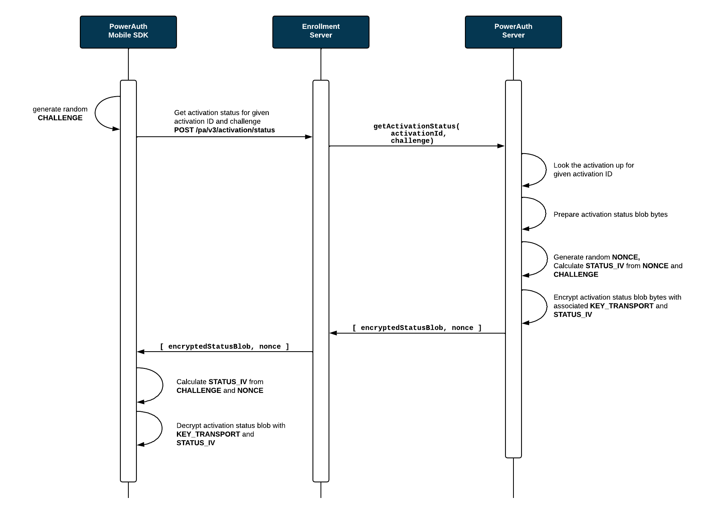

# Activation Status

PowerAuth Client may need to check for an activation status, so that it can determine if it should display UI for non-activated state (registration form), blocked state (how to unblock tutorial) or active state (login screen). To facilitate this use-case, PowerAuth Standard RESTful API publishes a [/pa/v3/activation/status](./Standard-RESTful-API.md#activation-status) endpoint.

## Flow of the Activation Status Check

Checking for an activation status is simple. Client needs to prepare a HTTP request with an activation ID and random `STATUS_CHALLENGE`. Server processes the request and sends back the response with activation status blob and random `STATUS_NONCE`. Activation status blob is an encrypted binary blob that encodes activation status. Key `KEY_TRANSPORT` and `STATUS_IV` is used to encrypt the activation blob.

Following sequence diagram shows the activation status check in more detail.



## Status Blob Encryption

1. Both, client and server calculate `KEY_TRANSPORT_IV` as:
    ```java
    SecretKey KEY_TRANSPORT_IV = KDF.derive(KEY_TRANSPORT, 3000)
    ```
1. Client choose random 16 bytes long `STATUS_CHALLENGE` and send that value to the server:
   ```java
   byte[] STATUS_CHALLENGE = Generator.randomBytes(16)
   ```
1. Server choose random 16 bytes long `STATUS_NONCE` and calculates `STATUS_IV` as:
   ```java
   byte[] STATUS_NONCE = Generator.randomBytes(16)
   byte[] STATUS_IV_DATA = ByteUtils.concat(STATUS_CHALLENGE, STATUS_NONCE)
   byte[] STATUS_IV = KeyConversion.getBytes(KDF_INTERNAL.derive(KEY_TRANSPORT_IV, STATUS_IV_DATA))
   ```
1. Server uses `KEY_TRANSPORT` as key and `STATUS_IV` as IV to encrypt the status blob:
   ```java
   encryptedStatusBlob = AES.encrypt(statusBlob, STATUS_IV, KEY_TRANSPORT, "AES/CBC/NoPadding")
   ```
1. Server sends `encryptedStatusBlob` and `STATUS_NONCE` as response to the client.   
1. Client receives `encryptedStatusBlob` and `STATUS_NONCE` and calculates the same `STATUS_IV` and then decrypts the status data:
   ```java
   byte[] STATUS_IV_DATA = ByteUtils.concat(STATUS_CHALLENGE, STATUS_NONCE)
   byte[] STATUS_IV = KeyConversion.getBytes(KDF_INTERNAL.derive(KEY_TRANSPORT_IV, STATUS_IV_DATA))
   byte[] statusBlob = AES.decrypt(encryptedStatusBlob, STATUS_IV, KEY_TRANSPORT, "AES/CBC/NoPadding")
   ```
   
## Status Blob Format

When obtaining the activation status, application receives the binary status blob. Structure of the 32B long status blob is following:

```
0xDEC0DED1 1B:${STATUS} 1B:${CURRENT_VERSION} 1B:${UPGRADE_VERSION} 6B:${RESERVED} 1B:${FAIL_COUNT} 1B:${MAX_FAIL_COUNT} 1B:${CTR_LOOK_AHEAD} 16B:${CTR_DATA}
```

where:

- The first 4 bytes (`0xDE 0xC0 0xDE 0xD1`) are basically a fixed prefix.
    - Note that the last byte of this constant also represents the version of the status blob format. If we decide to change the status blob significantly, then the value will be changed to `0xD2`, `0xD3`, etc... 
- `${STATUS}` - A status of the activation record, it can be one of following values:
    - `0x01 - CREATED`
    - `0x02 - OTP_USED`
    - `0x03 - ACTIVE`
    - `0x04 - BLOCKED`
    - `0x05 - REMOVED`
- `${CURRENT_VERSION}` - 1 byte representing current version of crypto protocol, it can be one of following values:
    - `0x02` - PowerAuth protocol version `2.x`
    - `0x03` - PowerAuth protocol version `3.x`
- `${UPGRADE_VERSION}` - 1 byte representing maximum protocol version supported by the PowerAuth Server. The set of possible values is identical to `${CURRENT_VERSION}`
- `${RESERVED}` - 6 bytes reserved for the future use.
- `${FAIL_COUNT}` - 1 byte representing information about the number of failed attempts at the moment.
- `${MAX_FAIL_COUNT}` - 1 byte representing information about the maximum allowed number of failed attempts.
- `${CTR_LOOK_AHEAD}` - 1 byte representing constant for a look ahead window, used on the server to validate the signature.
- `${CTR_DATA}` - 16 bytes containing current value of hash-based counter.

