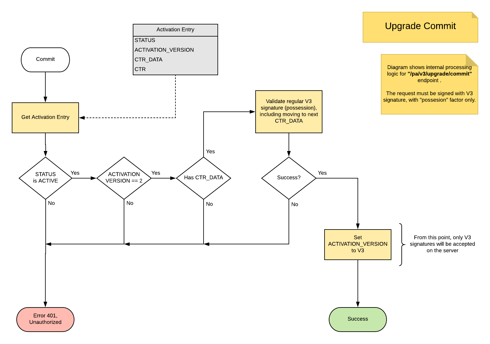
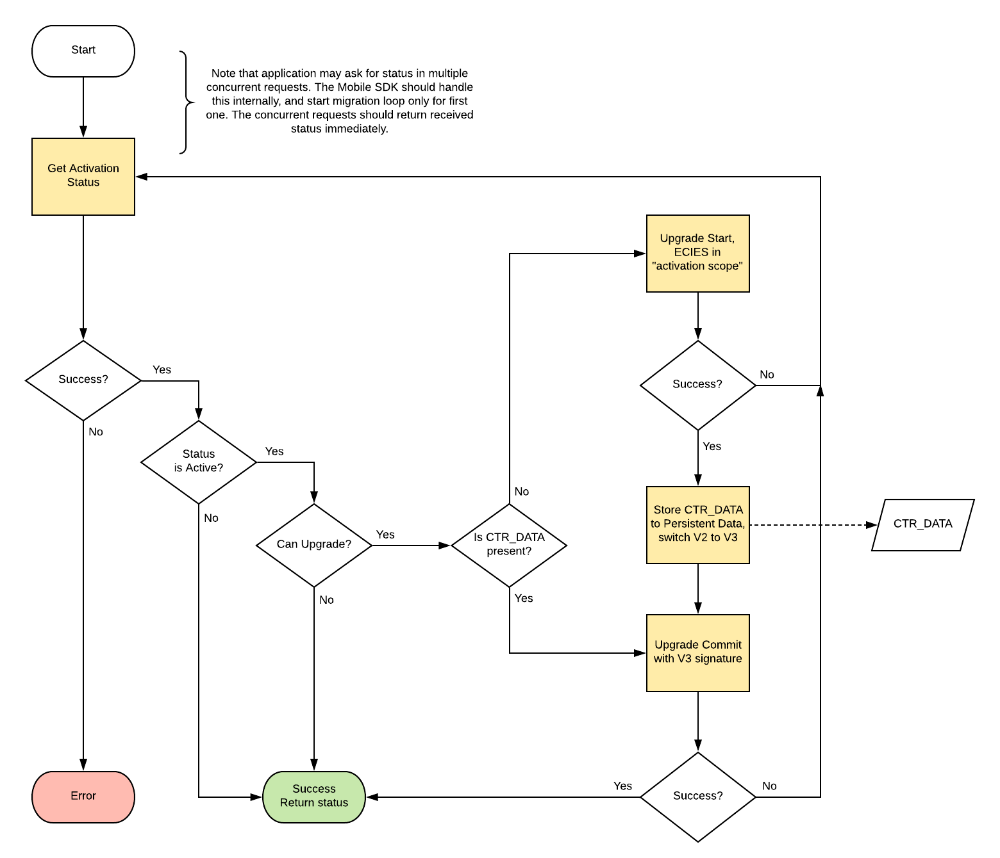

# Activation Upgrade

This document describes how PowerAuth protocol is upgraded from an older to a newer version. Currently, only upgrade from protocol `V2` to `V3` is defined.

### Test upgrade availability

PowerAuth Client can detect whether the activation upgrade is possible by fetching an [activation status](./Activation-Status.md). The encrypted status blob contains two protocol version related values:

- `${CURRENT_VERSION}`, represents current version of protocol, stored on PowerAuth Server.
- `${UPGRADE_VERSION}`, represents maximum supported version of protocol, supported by PowerAuth Server. If value is higher than `${CURRENT_VERSION}`, then the protocol upgrade is available.

As you can see, to determine whether the upgrade is possible is quite easy. The last requirement is that PowerAuth Client must support that upgrade process to the latest protocol version available on the server. PowerAuth Server typically provides backward compatibility for clients still communicating in older version of the protocol. All that basically means, that you need to update PowerAuth Mobile SDK in your application, once the newer server is deployed to the production.

## Upgrade to V3

Due to changes we have introduced in protocol version 3, the main purpose of the upgrade is to securely acquire an initial value of hash-based counter (we call this value as `CTR_DATA`). In order to do that, there are two new endpoints in PowerAuth RESTful API:

- `/pa/v3/upgrade/start` - PowerAuth Client initiates an upgrade process. The response contains an initial `CTR_DATA` value. The whole request and response is protected by our ECIES encryption scheme.
- `/pa/v3/upgrade/commit` - PowerAuth Client commits and finishes the upgrade process. The request must be signed with PowerAuth Signature in version 3, with the "possession" factor involved.

### Upgrade Start endpoint

This diagram shows how start of upgrade is implemented on PowerAuth Server.

Diagram explained:

1. PowerAuth Server gets an activation entry for an activation, to be upgraded. 
   - This step must also implement a basic validations, like check, whether the requested activation for `ACTIVATION_ID` exists.

2. If status of activation is not `ACTIVE`, then "400 - Bad Request" error is returned.
   - Makes no sense to upgrade an unfinished, blocked or removed activations 

3. If current activation version is not `V2`, then "400 - Bad Request" error is returned. 
   - This step is basically a prevention that upgrade cannot be started, once the activation is already upgraded.

4. Generate `CTR_DATA` only once
   - Server should not re-generate `CTR_DATA` for each subsequent call to "start". If we do such thing, then the attacker may change the value on the server, because our ECIES doesn't prevent against replay attacks. That will basically invalidate the activation on the server, because client will no longer be able to calculate a valid signature.
   
5. Return `CTR_DATA` in response object.
   - Note that the sequence doesn't show ECIES request decryption and the response encryption.

### Upgrade Commit endpoint

This diagram shows how upgrade commit is implemented on PowerAuth Server.

Diagram explained:

1. PowerAuth Server gets an activation entry for an activation, to be upgraded. 
   - This step must also implement a basic validations, like check, whether the requested activation for `ACTIVATION_ID` exists.

2. If status of activation is not `ACTIVE`, then "401 - Unauthorized" error is returned.
   - Makes no sense to upgrade an unfinished, blocked or removed activations 

3. If current activation version is not `V2`, then "401 - Unauthorized" error is returned.
   - This step is basically a prevention that upgrade cannot be started, once the activation is already upgraded.

4. If database doesn't contain `CTR_DATA`, then "401 - Unauthorized" error is returned.

5. PowerAuth Server validates signature. The validation must enforce signature version V3, to check, whether the client calculated the signature with right `CTR_DATA`.
   - In case of failure, the "401 - Unauthorized" error is returned.

6. PowerAuth Server now can set version of activation to V3 
   - From this point, only `V3` signatures will be accepted on the server. 
   - The client also gets `V3` in the next encrypted activation status blob.

### PowerAuth Client sequence

Following diagram shows the upgrade process form PowerAuth Client perspective.

The PowerAuth Client is typically implementing the upgrade process as a silent, transparent operation, as a part of [getting activation status](./Activation-Status.md):

1. PowerAuth Client gets an activation status blob (by requesting `/pa/v3/activation/status` endpoint)
   - In case of error, the error is immediately returned as the result of the whole operation.

2. If the current status of activation is not `ACTIVE`, then return the received status immediately

3. If upgrade is not available (see [Test upgrade availability](#test-upgrade-availability)), then return the received status blob immediately.

4. If client doesn't have `CTR_DATA` value locally, then continue with step 5, otherwise go to step 7.

5. Start the upgrade process, by requesting `/pa/v3/upgrade/start` endpoint
   - The request is encrypted with an "activation scoped" ECIES, `sh1="/pa/upgrade"` 
   - The response contains initial `CTR_DATA` value, which has to be exactly 16 bytes long.

6. Client can upgrade its local activation data to protocol `V3`. This step has following implications: 
   - Client must store `CTR_DATA` into its persistent data storage.
   - Each next PowerAuth Signature will be calculated as `V3`.

7. Commit the upgrade process, by requesting `/pa/v3/upgrade/commit` endpoint
   - The request is signed with `V3` signature

If the last step succeeds without an error, then the protocol is fully migrated to version 3. 

The whole upgrade process is designed to be reliable against a random network connection errors. The PowerAuth Client can typically recovery from such networking errors by simply retrying the whole upgrade process.
