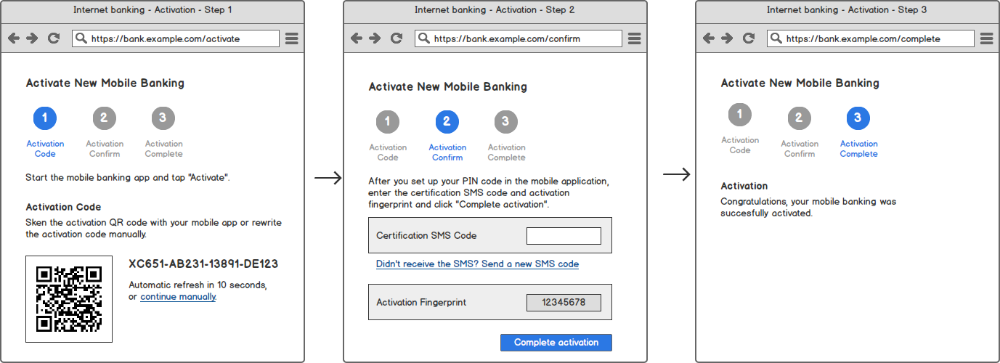
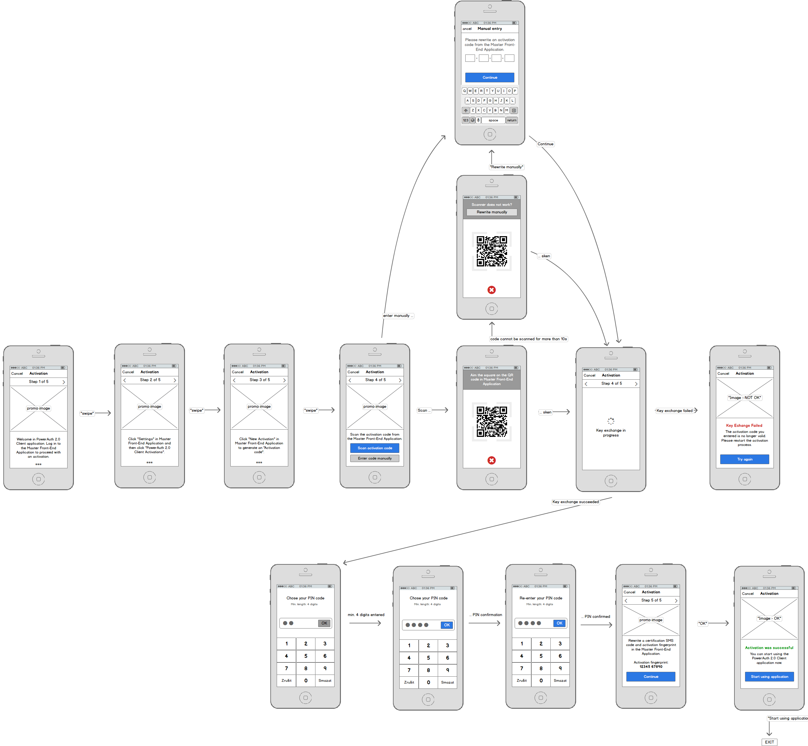
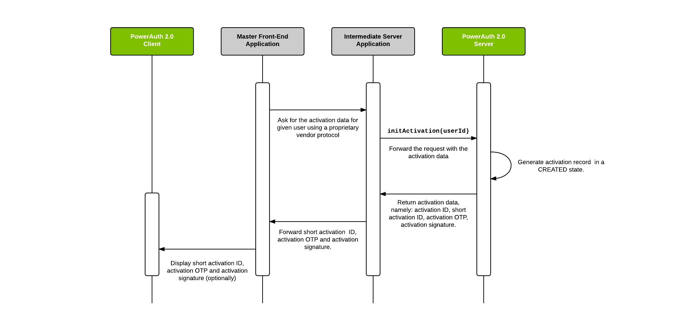
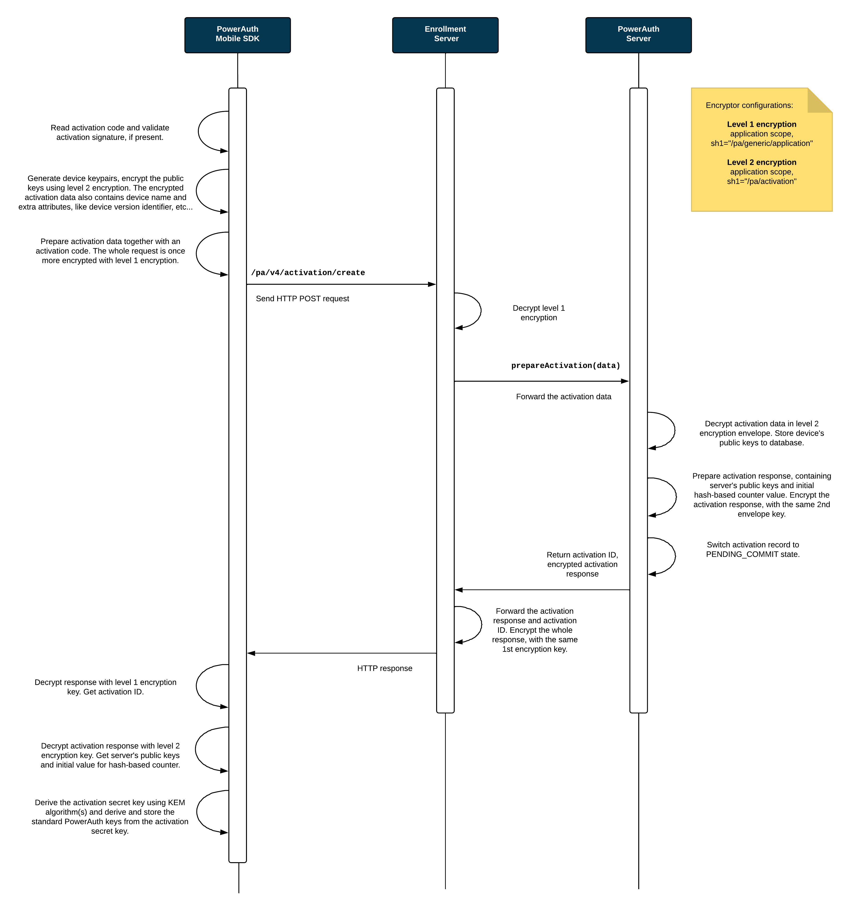
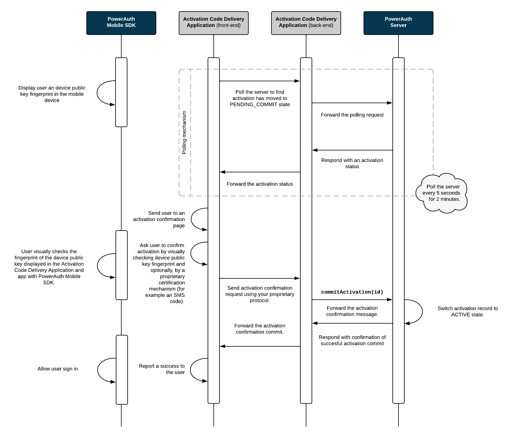

# Activation via Activation Code

The most straight forward activation type is "activation via the activation code". The activation code is a random one-time token value with limited time span associated with the particular user. Typically, the activation code is displayed as a QR code in the Internet banking, at branch kiosk, or ATM, or - as a less secure but more convenient alternative - it can be sent via SMS message or e-mail.

## Example User Flow

From the user perspective, activation via activation code is performed as a sequence of steps in the mobile app and Activation Code Delivery Application (i.e., in web Internet banking). The following steps (with possible user interface alterations) should be performed:

### Activation Code Delivery Application

The following diagram shows example steps in the Internet banking as an example application. You can apply similar principles to other Activation Code Delivery Applications, such as branch kiosk.

### Mobile Application

The following diagram shows example steps in the mobile banking app.

## Sequence Diagrams

The sequence diagrams below explain the PowerAuth key exchange during the activation via activation code. It shows how an app with PowerAuth Mobile SDK, Enrollment Server, Activation Code Delivery Application and PowerAuth Server play together in order to establish a shared secret between the client mobile application and the PowerAuth Server.

For the sake of the simplicity, we have split the process into three diagrams.

### Activation Initialization

This diagram shows how the Activation Code Delivery Application requests the activation data from the PowerAuth Server. The process is initiated by the Activation Code Delivery Application (for example, the Internet banking in the web browser) and it also ends here: by displaying the activation data so that they can be entered in the mobile app and passed to the PowerAuth Mobile SDK.

#### Process Description

1. The Activation Code Delivery Application requests a new activation for a given user.

1. PowerAuth Server generates an `ACTIVATION_ID` and `ACTIVATION_CODE`, `CTR_DATA` - an initial value for hash based counter, and server key pairs (ECDSA and ML-DSA). The activation code may optionally be signed with a hybrid signature, depending on the selected cryptographic algorithm. Due to the size of post-quantum signatures, QR codes typically contain only the activation code without signature.

1. Record associated with given `ACTIVATION_ID` is now in `CREATED` state.

1. Activation Code Delivery Application receives an `ACTIVATION_CODE` (and optional map of activation signatures for supported signature algorithms) and displays these information visually in the front-end so that a user can rewrite them in a mobile app with PowerAuth Mobile SDK.

### Key Exchange

This diagram shows how public keys are exchanged between the PowerAuth Mobile SDK and PowerAuth Server, and how the activation shared secret is established.

<!-- begin box info -->
The Activation Code Delivery Application plays no active role in the process of a key exchange.
<!-- end -->

#### Process Description

1. User enters the `ACTIVATION_CODE` (and optional activation signature) in the app with PowerAuth Mobile SDK. The entry can be manual or using a QR code with activation data.

1. If activation signature is present, PowerAuth Mobile SDK verifies it against `ACTIVATION_CODE` using server master public key for used signature algorithm. QR-based activations do not include signature and this step is skipped.

1. PowerAuth Mobile SDK generates new device signing key pairs (ECDSA and optionally ML-DSA, depending on selected algorithm).

1. PowerAuth Mobile SDK prepares a shared secret request (containing selected `algorithm` together with ECDHE / ML-KEM request parameters) and encrypts the payload using end-to-end encryption (application scope, `SHARED_INFO_1 = "/pa/activation"`).

1. PowerAuth Mobile SDK sends HTTPS request to the `/pa/v4/activation/create` endpoint with encrypted payload and `ACTIVATION_CODE`.

1. Enrollment Server decrypts the application-scoped end-to-end encryption envelope and forwards activation data to PowerAuth Server.

1. PowerAuth Server receives `ACTIVATION_CODE` and encrypted activation payload. The `ACTIVATION_CODE` identifies the record for a pending activation. If the record is unknown, then server returns a generic error.

1. PowerAuth Server decrypts activation payload, stores device public keys, and performs shared secret establishment according to selected algorithm (ECDHE / ML-KEM).

1. PowerAuth Server derives `KEY_ACTIVATION_SECRET`, generates its own signing key pairs (ECDSA / ML-DSA), initializes counter data (`CTR_DATA`), and changes the record status to `PENDING_COMMIT` (activation is now awaiting commit).

1. PowerAuth Server prepares encrypted response containing `ACTIVATION_ID`, `CTR_DATA`, shared secret response, and server public keys, and sends it back via Enrollment Server.

1. PowerAuth Mobile SDK decrypts the response, derives the same `KEY_ACTIVATION_SECRET`, stores server public keys, stores `CTR_DATA` locally, and encrypts and stores locally generated private keys using device key encryption key.

### Activation Commit

Finally, the last diagram shows how the Activation Code Delivery Application proactively checks the status of the activation and allows its completion by committing the activation record. A PowerAuth Mobile SDK plays a very little role in this step. It only allows showing a public key fingerprint in the mobile app to the user so that the key exchange can be visually confirmed before committing the activation.

Note that the activation commit step can be skipped in case activation is committed during key exchange, as described in chapter [Advanced Activation Flows](./Advanced-Activation-Flows.md).

#### Process Description

1. PowerAuth Mobile SDK displays `H_K_DEVICE_PUBLIC`, so that a user can visually verify the device public key correctness by comparing the `H_K_DEVICE_PUBLIC` value displayed in the Master Front-End Application. The fingerprint is calculated using SHA3-256 and includes algorithm identifier and all exchanged public keys (ECDSA and ML-DSA if applicable).

   <!-- begin box info -->
   Note: Client and server should allow checking the public key fingerprint before committing the activation. This is necessary so that user can verify the exchanged information in order to detect the MITM attack.
   <!-- end -->

1. Activation Code Delivery Application allows completion of the activation. For example, it may ask the user to enter an OTP code delivered via an SMS message. Activation Code Delivery Application commits the activation by calling the `/pa/v4/activation/commit` service on PowerAuth Server.

1. PowerAuth Server sets activation to `ACTIVE` state (the activation still requires client confirmation).

1. After activation becomes `ACTIVE`, PowerAuth Mobile SDK calls `/pa/v4/activation/confirm` (authenticated with `possession_knowledge` factors) to finalize local activation state, optionally configure the biometric factor, and clear `the pending_confirmation` flag on the server in the database.

## Related Topics

- [Activation Code Format](Activation-Code.md)
- [Activation via Custom Credentials](./Activation-via-Custom-Credentials.md)
- [Checking Activation Status](./Activation-Status.md)
- [Key Derivation](./Key-derivation.md)
- [Advanced Activation Flows](./Advanced-Activation-Flows.md)

