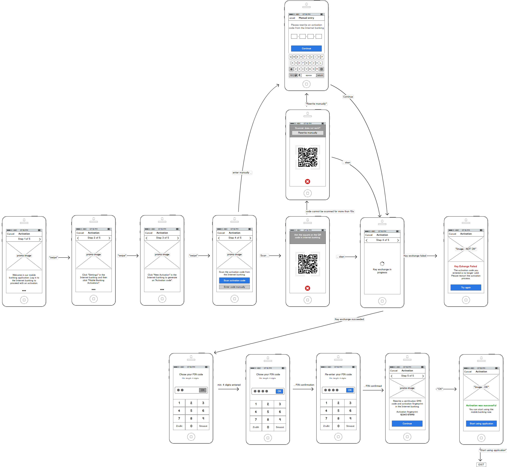
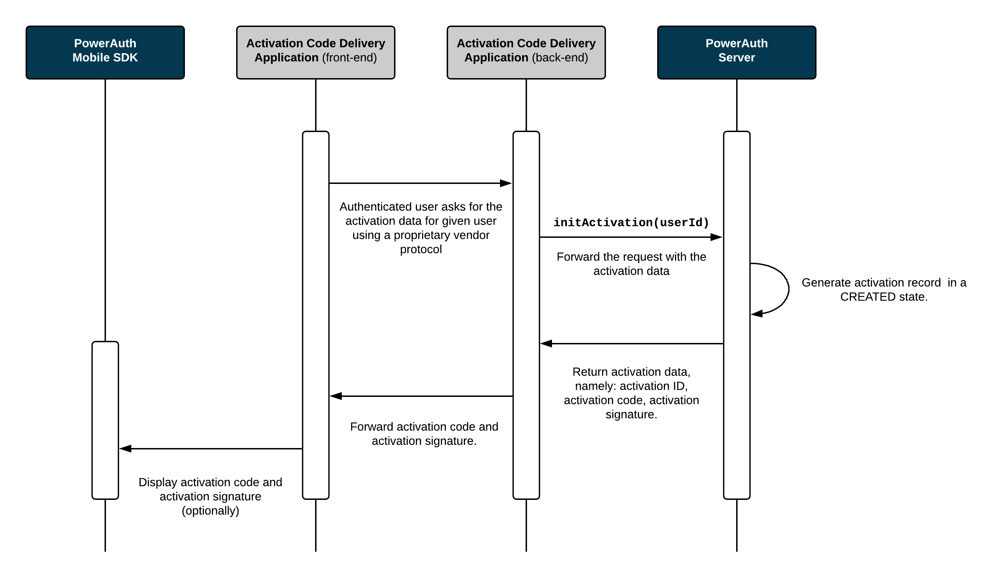

# Activation via Activation Code

The most straight forward activation type is "activation via the activation code". The activation code is a random one-time token value with limited time span associated with the particular user. Typically, the activation code is displayed as a QR code in the Internet banking, at branch kiosk, or ATM, or - as a less secure but more convenient alternative - it can be sent via SMS message or e-mail.

## Example User Flow

From the user perspective, activation via activation code is performed as a sequence of steps in the mobile app and Activation Code Delivery Application (i.e., in web Internet banking). The following steps (with possible user interface alterations) should be performed:

### Activation Code Delivery Application

The following diagram shows example steps in the Internet banking as an example application. You can apply similar principles to other Activation Code Delivery Applications, such as branch kiosk.


### Mobile Application

The following diagram shows example steps in the mobile banking app.



## Sequence Diagrams

The sequence diagrams below explain the PowerAuth key exchange during the activation via activation code. It shows how an app with PowerAuth Mobile SDK, Enrollment Server, Activation Code Delivery Application and PowerAuth Server play together in order to establish a shared secret between the client mobile application and the PowerAuth Server.

For the sake of the simplicity, we have split the process into three diagrams.

### Activation Initialization

This diagram shows how the Activation Code Delivery Application requests the activation data from the PowerAuth Server. The process is initiated by the Activation Code Delivery Application (for example, the Internet banking in the web browser) and it also ends here: by displaying the activation data so that they can be entered in the mobile app and passed to the PowerAuth Mobile SDK.



#### Process Description

1. The Activation Code Delivery Application requests a new activation for a given user.

1. PowerAuth Server generates an `ACTIVATION_ID`, `ACTIVATION_CODE`, `CTR_DATA` - an initial value for hash based counter, and a key pair `(KEY_SERVER_PRIVATE, KEY_SERVER_PUBLIC)`. Server also computes a signature `ACTIVATION_SIGNATURE` of `ACTIVATION_CODE` using servers master private key `KEY_SERVER_MASTER_PRIVATE`.
   ```java
   String ACTIVATION_ID = Generator.randomUUID()
   String ACTIVATION_CODE = Generator.randomActivationCode()  // must be unique among records in CREATED and PENDING_COMMIT states
   byte[] CTR_DATA = Generator.randomBytes(16)
   KeyPair keyPair = KeyGenerator.randomKeyPair()
   PrivateKey KEY_SERVER_PRIVATE = keyPair.getPrivate()
   PublicKey KEY_SERVER_PUBLIC = keyPair.getPublic()
   byte[] DATA = ByteUtils.encode(ACTIVATION_CODE)
   byte[] ACTIVATION_SIGNATURE = ECDSA.sign(DATA, KEY_SERVER_MASTER_PRIVATE)
   ```

1. Record associated with given `ACTIVATION_ID` is now in `CREATED` state.

1. Activation Code Delivery Application receives an `ACTIVATION_CODE` and `ACTIVATION_SIGNATURE` (optional) and displays these information visually in the front-end so that a user can rewrite them in a mobile app with PowerAuth Mobile SDK.

### Key Exchange

This diagram shows how public keys are exchanged between the PowerAuth Mobile SDK and PowerAuth Server, and how the master shared secret and PowerAuth Standard Keys are derived.

<!-- begin box info -->
The Activation Code Delivery Application plays no active role in the process of a key exchange.
<!-- end -->


#### Process Description

1. User enters the `ACTIVATION_CODE` and `ACTIVATION_SIGNATURE` (optional) in the app with PowerAuth Mobile SDK. The entry can be manual or using a QR code with activation data.

1. PowerAuth Mobile SDK verifies the `ACTIVATION_SIGNATURE` against `ACTIVATION_CODE` using `KEY_SERVER_MASTER_PUBLIC` and if the signature matches, it proceeds.
   ```java
   byte[] DATA = ByteUtils.encode(ACTIVATION_CODE)
   boolean isOK = ECDSA.verify(DATA, ACTIVATION_SIGNATURE, KEY_SERVER_MASTER_PUBLIC)
   ```

1. PowerAuth Mobile SDK generates its key pair `(KEY_DEVICE_PRIVATE, KEY_DEVICE_PUBLIC)`.
   ```java
   KeyPair keyPair = KeyGenerator.randomKeyPair()
   PrivateKey KEY_DEVICE_PRIVATE = keyPair.getPrivate()
   PublicKey KEY_DEVICE_PUBLIC = keyPair.getPublic()
   ```

1. PowerAuth Mobile SDK encrypts the payload containing `KEY_DEVICE_PUBLIC` with an application scoped ECIES (level 2, `sh1="/pa/activation"`). Let's call the result of this step as `ACTIVATION_DATA`.

1. PowerAuth Mobile SDK encrypts payload containing `ACTIVATION_DATA` and `ACTIVATION_CODE` with an application scoped ECIES (level 1, `sh1="/pa/generic/application"`) and sends HTTPS request to the `/pa/v3/activation/create` endpoint.

1. Enrollment Server decrypts the ECIES envelope, with an application scoped ECIES (level 1, `sh1="/pa/generic/application"`) and calls PowerAuth Server with `ACTIVATION_DATA`. At this step, the `ACTIVATION_CODE` is be used to identify the pending activation.

1. PowerAuth Server receives `ACTIVATION_CODE` and `ACTIVATION_DATA` from Enrollment Server. The `ACTIVATION_CODE` identifies the record for a pending activation. If the record is unknown, then server returns a generic error.

1. PowerAuth Server decrypts `ACTIVATION_DATA` using an application scoped ECIES (level 2, `sh1="/pa/activation"`) and stores `KEY_DEVICE_PUBLIC` at given record.

1. PowerAuth Server generates its key pair `(KEY_SERVER_PRIVATE, KEY_SERVER_PUBLIC)`.
   ```java
   KeyPair keyPair = KeyGenerator.randomKeyPair()
   PrivateKey KEY_SERVER_PRIVATE = keyPair.getPrivate()
   PublicKey KEY_SERVER_PUBLIC = keyPair.getPublic()
   ```

1. PowerAuth Server uses `KEY_DEVICE_PUBLIC` and `KEY_SERVER_PRIVATE` to deduce `KEY_MASTER_SECRET` using ECDH.
   ```java
   KEY_MASTER_SECRET = ByteUtils.convert32Bto16B(ECDH.phase(KEY_SERVER_PRIVATE, KEY_DEVICE_PUBLIC))
   ```

1. PowerAuth Server changes the record status to `PENDING_COMMIT`.

1. PowerAuth Server encrypts response, containing `ACTIVATION_ID`, `CTR_DATA`, `KEY_SERVER_PUBLIC` with the same key as was used for ECIES level 2 decryption. This data is one more time encrypted by Enrollment Server, with the same key from ECIES level 1, and the response is sent to the PowerAuth Client.

1. PowerAuth Mobile SDK decrypts the response with both levels of ECIES, in the right order and receives `ACTIVATION_ID`, `KEY_SERVER_PUBLIC`, `CTR_DATA` and stores all that values locally in the volatile memory on the device.

1. PowerAuth Mobile SDK uses `KEY_DEVICE_PRIVATE` and `KEY_SERVER_PUBLIC` to deduce `KEY_MASTER_SECRET` using ECDH.
   ```java
   KEY_MASTER_SECRET = ByteUtils.convert32Bto16B(ECDH.phase(KEY_DEVICE_PRIVATE, KEY_SERVER_PUBLIC))
   ```

### Activation Commit

Finally, the last diagram shows how the Activation Code Delivery Application proactively checks the status of the activation and allows its completion by committing the activation record. A PowerAuth Mobile SDK plays a very little role in this step. It only allows showing a public key fingerprint in the mobile app to the user so that the key exchange can be visually confirmed before committing the activation.


Note that the activation commit step can be skipped in case activation is committed during key exchange, as described in chapter [Advanced Activation Flows](./Advanced-Activation-Flows.md).

#### Process Description

1. PowerAuth Mobile SDK displays `H_K_DEVICE_PUBLIC`, so that a user can visually verify the device public key correctness by comparing the `H_K_DEVICE_PUBLIC` value displayed in the Master Front-End Application.
   ```java
   byte[] activationIdBytes = ByteUtils.encode(ACTIVATION_ID)
   byte[] fingerprintBytes = ByteUtils.concat(K_DEVICE_PUBLIC_BYTES, activationIdBytes, K_SERVER_PUBLIC_BYTES)
   byte[] truncatedBytes = ByteUtils.truncate(Hash.sha256(fingerprintBytes), 4)
   int H_K_DEVICE_PUBLIC = ByteUtils.getInt(truncatedBytes) & 0x7FFFFFFF) % (10 ^ 8)
   ```
   <!-- begin box info -->
   Note: Client and server should allow checking the public key fingerprint before committing the activation. This is necessary so that user can verify the exchanged information in order to detect the MITM attack.
   <!-- end -->

1. Activation Code Delivery Application allows completion of the activation. For example, it may ask the user to enter an OTP code delivered via an SMS message. Activation Code Delivery Application commits the activation by calling the `/pa/v3/activation/commit` service on PowerAuth Server.

1. Record associated with given `ACTIVATION_ID` is now in `ACTIVE` state.

## Related Topics

- [Activation Code Format](Activation-Code.md)
- [Activation via Custom Credentials](./Activation-via-Custom-Credentials.md)
- [Checking Activation Status](./Activation-Status.md)
- [Key Derivation](./Key-derivation.md)
- [Advanced Activation Flows](./Advanced-Activation-Flows.md)

