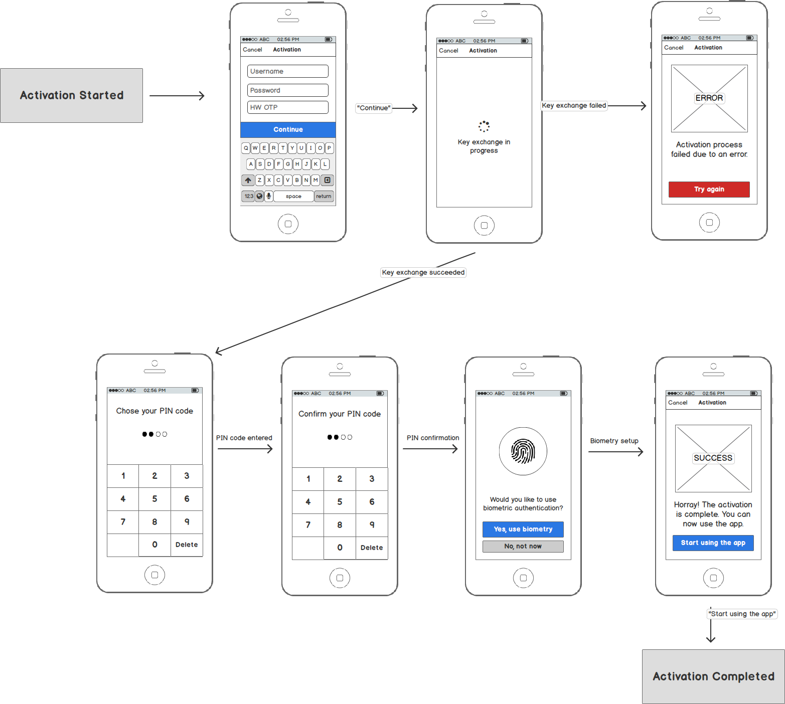
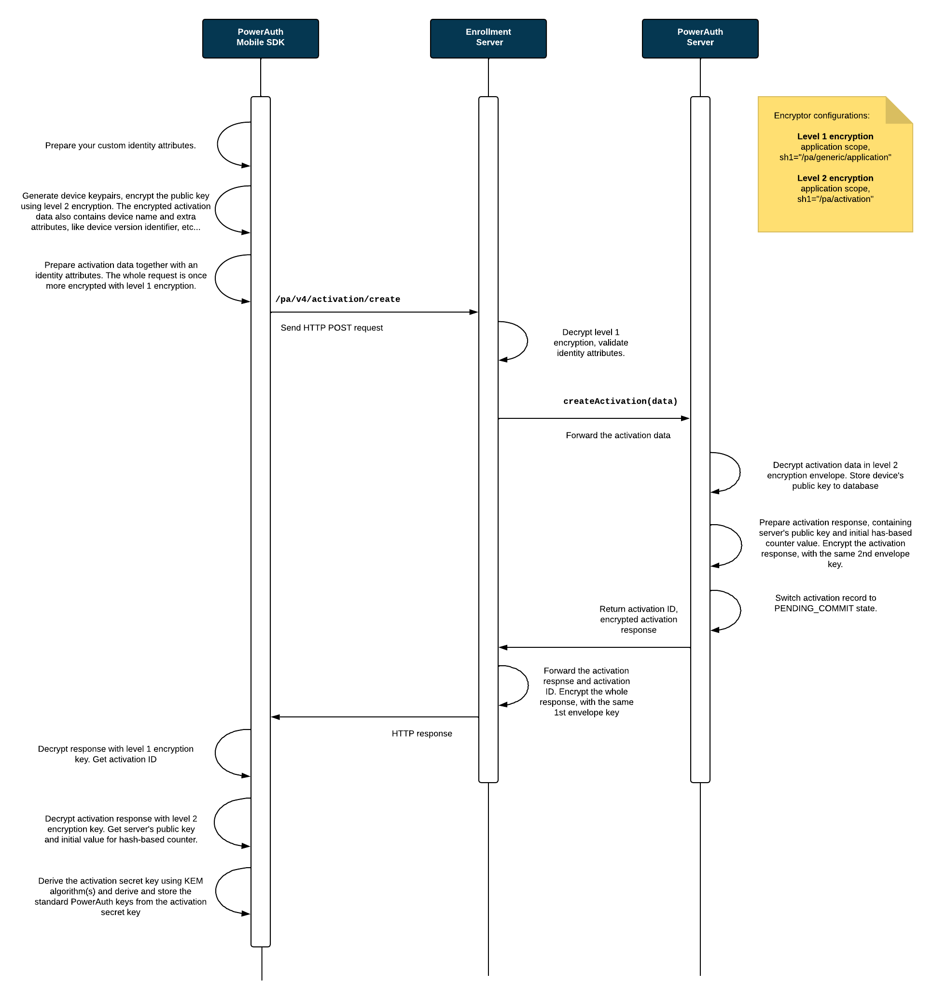

# Activation via Custom Credentials

The most flexible type of activation is "activation via the custom credentials". In this flow, the credentials are provided as a key-value map. Enrollment Server is responsible for verifying the credentials with an external service that returns a user ID in response.

## Example User Flow

From the user perspective, activation via custom credentials is performed as a sequence of steps in the mobile app. The following diagram shows example steps in the mobile banking app.

## Sequence Diagrams

The sequence diagrams below explain the PowerAuth key exchange during activation with custom credentials. It shows how an app with PowerAuth Mobile SDK, Enrollment Server and PowerAuth Server play together in order to establish a shared secret between the client mobile application and the PowerAuth Server.

#### Process Description

1. User enters the credentials identity attributes `IDENTITY_ATTRIBUTES` in the app with PowerAuth Mobile SDK. The entry can be manual or fully/partially handled using other mechanisms, such as deeplink.

1. PowerAuth Mobile SDK generates new device signing key pairs (ECDSA and optionally MLDSA, depending on selected algorithm).

1. PowerAuth Mobile SDK prepares a shared secret request (containing selected `algorithm` together with ECDHE / ML-KEM contributions) and device public keys, and encrypts the payload using activation creation end-to-end encryption (application scope, E2EE V4, `SHARED_INFO_1 = "/pa/activation"`).

1. PowerAuth Mobile SDK sends HTTPS request to the `/pa/v4/activation/create` endpoint with encrypted payload and `IDENTITY_ATTRIBUTES`.

1. Enrollment Server decrypts the application-scoped E2EE envelope.

1. Enrollment Server verifies `IDENTITY_ATTRIBUTES` using its custom processing logic. As a result of this processing, Enrollment Server obtains a `USER_ID` value representing a unique identifier of the user with provided credentials.

1. Enrollment Server forwards encrypted activation payload together with `USER_ID` to PowerAuth Server.

1. PowerAuth Server receives `USER_ID` and encrypted activation payload.

1. PowerAuth Server decrypts activation payload, stores device public keys, and performs shared secret establishment according to selected algorithm (ECDHE / ML-KEM).

1. PowerAuth Server derives `KEY_ACTIVATION_SECRET`, generates its own signing key pairs (ECDSA / MLDSA), initializes counter data (`CTR_DATA`), sets activation state to `PENDING_COMMIT` (activation is now awaiting commit and client confirmation).

1. PowerAuth Server prepares encrypted response containing `ACTIVATION_ID`, `CTR_DATA`, shared secret response, and server public keys, and sends it back via Enrollment Server.

1. PowerAuth Mobile SDK decrypts the response, derives the same `KEY_ACTIVATION_SECRET`, stores server public keys, stores `CTR_DATA` locally, and encrypts and stores locally generated private keys using device key encryption key.

### Activation Commit

Enrollment Server typically commits activations created via custom credentials automatically. This is the most common and recommended behavior.

1. Enrollment Server commits the activation by calling `/pa/v4/activation/commit` on PowerAuth Server.

1. PowerAuth Server sets activation to `ACTIVE` state (the activation still requires client confirmation).

If required by a specific use case, Enrollment Server may postpone the commit and keep activation in `PENDING_COMMIT` until explicitly committed later.

### Activation Confirmation

After activation becomes `ACTIVE`, the mobile application must finalize activation on the client side:

1. PowerAuth Mobile SDK calls `/pa/v4/activation/confirm` (authenticated with possession + knowledge).

1. PowerAuth Server clears `pendingConfirmation` flag and stores initial factor configuration (for example biometric factor, if requested).

1. PowerAuth Mobile SDK finalizes local activation state and completes factor setup.

## Related Topics

- [Activation via Activation Code](./Activation-via-Activation-Code.md)
- [Checking Activation Status](./Activation-Status.md)
- [Key Derivation](./Key-derivation.md)
- [Advanced Activation Flows](./Advanced-Activation-Flows.md)
