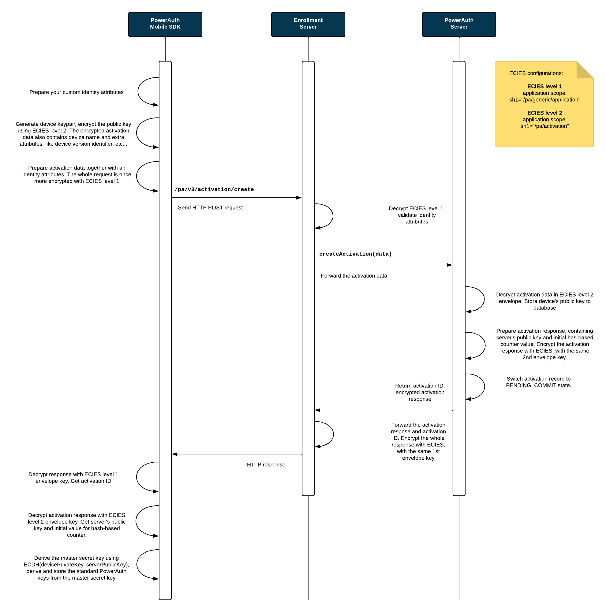

# Activation via Custom Credentials

The most flexible type of activation is "activation via the custom credentials". In this flow, the credentials is provided as a key-value map. Enrollment Server is then responsible for verifying the credentials with an external service that returns a user ID in response.

## Example User Flow

From the user perspective, activation via custom credentials is performed as a sequence of steps in the mobile app. The following diagram shows example steps in the mobile banking app.


## Sequence Diagrams

The sequence diagrams below explain the PowerAuth key exchange during activation with custom credentials. It shows how an app with PowerAuth Mobile SDK, Enrollment Server and PowerAuth Server play together in order to establish a shared secret between the client mobile application and the PowerAuth Server.



#### Process Description

1. User enters the credentials identity attributes `IDENTITY_ATTRIBUTES` in the app with PowerAuth Mobile SDK. The entry can be manual or fully/partially handled using other mechanism, such as deeplink.

1. PowerAuth Mobile SDK generates its key pair `(KEY_DEVICE_PRIVATE, KEY_DEVICE_PUBLIC)`.
   ```java
   KeyPair keyPair = KeyGenerator.randomKeyPair()
   PrivateKey KEY_DEVICE_PRIVATE = keyPair.getPrivate()
   PublicKey KEY_DEVICE_PUBLIC = keyPair.getPublic()
   ```

1. PowerAuth Mobile SDK encrypts the payload containing `KEY_DEVICE_PUBLIC` with an application scoped ECIES (level 2, `sh1="/pa/activation"`). Let's call the result of this step as `ACTIVATION_DATA`.

1. PowerAuth Mobile SDK encrypts payload containing `ACTIVATION_DATA` and `IDENTITY_ATTRIBUTES` with an application scoped ECIES (level 1, `sh1="/pa/generic/application"`) and sends HTTPS request to the `/pa/v3/activation/create` endpoint.

1. Enrollment Server decrypts the ECIES envelope, with an application scoped ECIES (level 1, `sh1="/pa/generic/application"`).

1. Enrollment Server obtains `IDENTITY_ATTRIBUTES` and verifies the identity attributes using own custom processing logic. As a result of this processing, Enrollment Server obtains a `USER_ID` value representing a unique identifier of the user with provided credentials.

1. Enrollment Server calls PowerAuth Server with `ACTIVATION_DATA` and `USER_ID` value.

1. PowerAuth Server receives `USER_ID` and `ACTIVATION_DATA` from Enrollment Server.

1. PowerAuth Server decrypts `ACTIVATION_DATA` using an application scoped ECIES (level 2, `sh1="/pa/activation"`), creates a new activation in `PENDING_COMMIT` status for the user with provided `USER_ID` and stores `KEY_DEVICE_PUBLIC`.

1. PowerAuth Server generates its key pair `(KEY_SERVER_PRIVATE, KEY_SERVER_PUBLIC)`.
   ```java
   KeyPair keyPair = KeyGenerator.randomKeyPair()
   PrivateKey KEY_SERVER_PRIVATE = keyPair.getPrivate()
   PublicKey KEY_SERVER_PUBLIC = keyPair.getPublic()
   ```

1. PowerAuth Server uses `KEY_DEVICE_PUBLIC` and `KEY_SERVER_PRIVATE` to deduce `KEY_MASTER_SECRET` using ECDH.
   ```java
   KEY_MASTER_SECRET = ByteUtils.convert32Bto16B(ECDH.phase(KEY_SERVER_PRIVATE, KEY_DEVICE_PUBLIC))
   ```

1. PowerAuth Server encrypts response, containing `ACTIVATION_ID`, `CTR_DATA`, `KEY_SERVER_PUBLIC` with the same key as was used for ECIES level 2 decryption. This data is one more time encrypted by Enrollment Server, with the same key from ECIES level 1, and the response is sent to the PowerAuth Client.

1. PowerAuth Mobile SDK decrypts the response with both levels of ECIES, in the right order and receives `ACTIVATION_ID`, `KEY_SERVER_PUBLIC`, `CTR_DATA` and stores all that values locally in the volatile memory on the device.

1. PowerAuth Mobile SDK uses `KEY_DEVICE_PRIVATE` and `KEY_SERVER_PUBLIC` to deduce `KEY_MASTER_SECRET` using ECDH.
   ```java
   KEY_MASTER_SECRET = ByteUtils.convert32Bto16B(ECDH.phase(KEY_DEVICE_PRIVATE, KEY_SERVER_PUBLIC))
   ```

### Implicit Activation Commit

Enrollment Server may automatically commit activations via custom credentials - typically, this is the desired behavior. As a result, the activation will immediately switch to the `ACTIVE` status.

However, if the particular use case requires different handling, the enrollment server behavior may be customized and activation can remain in `PENDING_COMMIT` state until it is committed by calling the commit service.

## Related Topics

- [Activation via Activation Code](./Activation-via-Activation-Code.md)
- [Checking Activation Status](./Activation-Status.md)
- [Key Derivation](./Key-derivation.md)
- [Advanced Activation Flows](./Advanced-Activation-Flows.md)