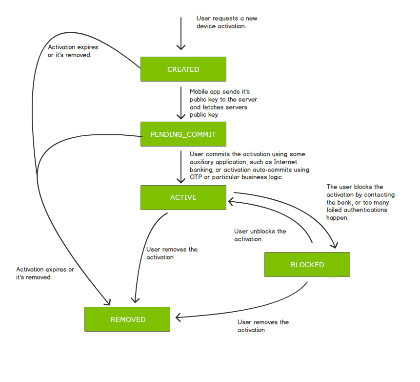

# Activation

Before a client can perform authentication and transaction signing, it must first share the same shared master secret `KEY_MASTER_SECRET` with the server. In order to establish this shared secret, a key exchange must take a place. We call this key exchange process "the activation". The `KEY_MASTER_SECRET` is a symmetric key that is used as a base for deriving further purpose specific symmetric keys, used for example for an HTTP request signing.

## Activation States

The following diagram shows transitions between activation states:

<!-- begin box info -->
After the activation is initiated, an activation record is created in the database in the `CREATED` state. The client application must perform a key exchange to proceed the activation forward. If the activation requires an additional approval ("commit"), an external system must push the status of the activation from `PENDING_COMMIT` to the `ACTIVE` state before the activation can be used.
<!-- end -->

| State              | Description |
|--------------------|-------------|
| **CREATED**        | The activation record is created but the key exchange between the client and server did not happen yet. |
| **PENDING_COMMIT** | The activation record is created and key exchange between the client and server already took place, but the activation record needs additional approval before it can be used. |
| **ACTIVE**         | The activation record is created and active. It is ready to be used for generating signatures. |
| **BLOCKED**        | The activation record is blocked and cannot be used for generating signatures. It can be unblocked and activated again. |
| **REMOVED**        | The activation record is removed and permanently blocked - cannot be used for generating signatures or unblocked. |

## Activation Flow Principle

The basic underlying principle of the activation process is simple: The PowerAuth Client application sends its public key to the server (optionally, with the [Activation OTP](./Additional-Activation-OTP.md)), and in exchange, it receives the server public key, initial counter value, and activation ID from the PowerAuth Server.

Of course, to make this process work (and work in a secure manner, indeed), there are several aspects that require more clarification.

### Activation Credentials

First of all, each activation request generated by the PowerAuth Client application uses some type of activation credentials that uniquely identify the specific user.

The activation credentials may be arbitrary and selected by a customer. We call activation that uses such a credentials an "activation via custom credentials". Such credentials can be essentially anything - username and password, phone number and SMS OTP, anything that uniquely identifies the user technically works. The custom credentials must be verified against an existing service during the activation flow.

More commonly, though, the activation credentials are managed by our systems. The typical activation type uses an "activation code". An activation code is a temporary, single use token that is strongly connected to a specific user and to pre-initialized activation record. Activation code is issued for a given user via an application where the user already is authenticated (such as the Internet banking). Another type of credentials are "recovery codes". Recovery code is generated during a successful activation and stored on the mobile device, protected by a PIN code.

You can read more about specific activation types in dedicated chapters:

- [Activation via Activation Code](./Activation-via-Activation-Code.md)
- [Activation via Recovery Code](./Activation-Recovery.md)
- [Activation via Custom Credentials](#activation-via-custom-credentials)

### Application-Level Encryption

Since the activation process transfers sensitive data payloads and user credentials between the PowerAuth Client and PowerAuth Server, additional application level encryption is used during the process.

The end-to-end encrypted is actually performed twice. The first layer of encryption protects the data transfer between the PowerAuth Client and intermediate Enrollment Server component. After unwrapping the first layer, the Enrollment Server gains access to the activation type and activation specific credentials. However, the Enrollment Server cannot unwrap the second encryption layer. Instead, the Enrollment Server must pass the encrypted activation data to PowerAuth Server alongside either the user ID (for custom credentials), activation code (for activation via activation code) or recovery code (for activation via recovery code). The PowerAuth Server then stores the activation data that client sent and it responds with an encrypted payload (again, the Enrollment Server cannot decrypt this payload). The Enrollment server finally re-encrypts the response and sends it to the PowerAuth Client.

A good place to review the exact request and response payload structure is in the [PowerAuth Standard RESTful API documentation](./Standard-RESTful-API.md#post-pav3activationcreate).

### Key Derivation

After completing the activation flow, the PowerAuth Client and PowerAuth Server must derive additional factor specific signing keys that are based on a shared secret established during the activation.

The PowerAuth Client then stores these derived keys and throws away the unencrypted device private key and any intermediate products of the activation process. Only the derived keys are stored on the PowerAuth Client using a method appropriate for the particular key.

For example, a signature key related to the "knowledge factor" is stored encrypted using a key derived from a PIN code, a signature key related to the "biometry factor" is stored encrypted with a key that is retrieved from the biometric module of the device, etc.

The detailed description of the [Key Derivation](./Key-derivation.md) is available in a separate chapter.

## Related Topics

- [Activation Recovery](Activation-Recovery.md)
- [Additional Activation OTP](Additional-Activation-OTP.md)
