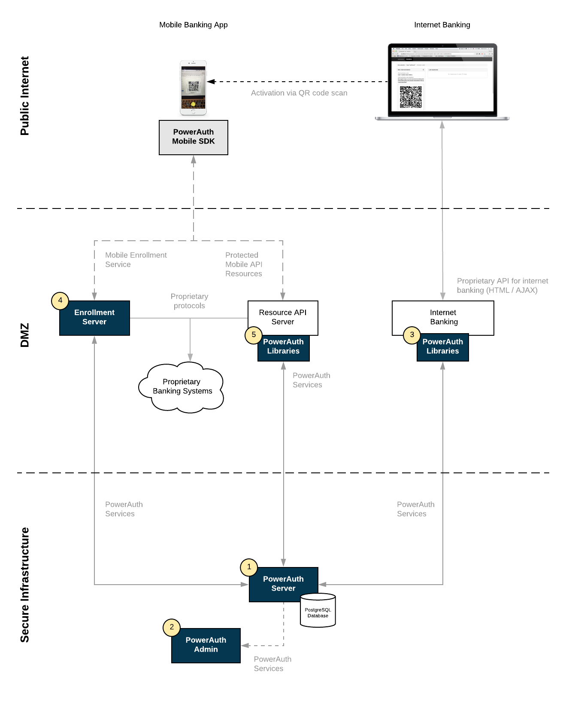

# Architecture Overview

PowerAuth architecture is designed so that the deployment can be very simple, but at the same time allows complex deployment alongside of other authentication methods (as a part of the central authentication / authorization component).

## Architecture Diagram

Following diagram captures the basic deployment strategy for the PowerAuth technology.

As you can see, there are only couple components present:

- Our back-end components
- Your existing back-end components
- Our integration libraries for your back-end components
- Our mobile SDK for iOS and Android apps

### Our Back-End Components

PowerAuth Deployment requires installation of just one easy to deploy component.

- PowerAuth Server
    - The core server component that manages activated devices, enables the activation process, verifies signatures and keeps system configuration.
    - Component communicates using SOAP or REST services.
    - Documentation:
        - [Deploying PowerAuth Server](https://github.com/wultra/powerauth-server/blob/develop/docs/Deploying-PowerAuth-Server.md)
- PowerAuth Admin _(optional)_
    - Simple GUI admin for managing the PowerAuth Server.
    - Documentation:
        - [Deploying PowerAuth Admin](https://github.com/wultra/powerauth-admin/blob/develop/docs/Deploying-PowerAuth-Admin.md)

### Your Back-End Components

PowerAuth installation has impact on several of your components:

- Mobile Banking API application - Application that publishes API that is consumed by the mobile clients.
- Activation Channels - Various types of applications used to activate PowerAuth Client, for example the internet banking, ATM interface, branch applications, etc.
- Internal bank systems / ESB - Of course, you can use any systems to proxy PowerAuth Server services.

### Our Back-End Integration Libraries

To simplify deployment, PowerAuth brings ready-to-use libraries for Java EE / Spring, namely:

- Easy to use PowerAuth Server SOAP service client (Axis2 or Spring-WS)
    - Documentation:
        - [SOAP Service Client for Spring](https://github.com/wultra/powerauth-server/blob/develop/docs/Configuring-SOAP-Client-for-Spring.md)
        - [SOAP Service Client for Axis2](https://github.com/wultra/powerauth-server/blob/develop/docs/Configuring-SOAP-Client-for-Axis2.md)
- High-level integration libraries that publish all required services and simplify signature validation (Java EE or Spring)
    - Documentation:
        - [RESTful API Security for Spring](https://github.com/wultra/powerauth-restful-integration/blob/develop/docs/RESTful-API-for-Spring.md)
        - [RESTful API Security for JAX-RS](https://github.com/wultra/powerauth-restful-integration/blob/develop/docs/RESTful-API-for-JavaEE.md)

### Our Mobile SDK for iOS or Android

You can integrate PowerAuth easily with your mobile app using our high-level SDK.

- Documentation:
    - [PowerAuth SDK for iOS](https://github.com/wultra/powerauth-mobile-sdk/blob/develop/docs/PowerAuth-SDK-for-iOS.md)
    - [PowerAuth SDK for Android](https://github.com/wultra/powerauth-mobile-sdk/blob/develop/docs/PowerAuth-SDK-for-Android.md)
