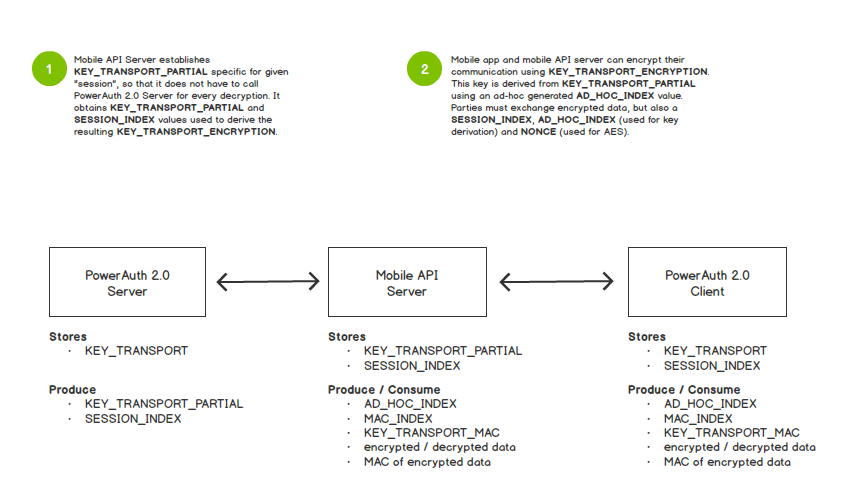

# End-to-End Encryption

## Standard ECIES Based End-to-End Encryption

PowerAuth supports a standard ECIES encryption (integrated encryption scheme that uses elliptic curve cryptography) with the standard X9.63 (SHA256) KDF function (that produces 32b long keys).

### ECIES Encryption

Assume we have a public key `KEY_ENC_PUB`, data `DATA_ORIG` to be encrypted and an optional `info` and `sharedInfo2` instances (`byte[]`) as an encryption parameters. ECIES encryption works in a following way:

1. Generate an ephemeral key pair:
    ```java
    EPH_KEYPAIR = (KEY_EPH_PRIV, KEY_EPH_PUB).
    ```
2. Derive base secret key (in this step, we do not trim the key to 16b only, we keep all 32b).
    ```java
    SecretKey KEY_BASE = ECDH.phase(KEY_EPH_PRIV, KEY_ENC_PUB)
    ```
3. Derive a secret key using X9.63 KDF function (using SHA256 internally). When calling the KDF, we use `KEY_EPH_PUB` value (as raw `byte[]`) as an `info` parameter.
    ```java
    SecretKey KEY_SECRET = KDF_X9_63_SHA256.derive(KEY_BASE, KEY_EPH_PUB)
    ```
4. Split the 32b long `KEY_SECRET` to two 16b keys. The first part is used as an encryption key `KEY_ENC`. The second part is used as MAC key `KEY_MAC`.
    ```java
    SecretKey KEY_ENC = ByteUtils.subarray(KEY_SECRET, 0, 16);
    SecretKey KEY_MAC = ByteUtils.subarray(KEY_SECRET, 16, 16);
    ```
5. Compute the encrypted data using AES, with zero `iv` value.
    ```java
    byte[] iv = ByteUtils.zeroBytes(16);
    byte[] DATA_ENCRYPTED = AES.encrypt(DATA_ORIG, iv, KEY_ENC)
    ```
6. Compute the MAC of encrypted data, include `sharedInfo2` if present.
    ```java
    byte[] DATA = (sharedInfo2 == null ? DATA_ENCRYPTED : Bytes.concat(DATA_ENCRYPTED, sharedInfo2);
    byte[] MAC = Mac.hmacSha256(KEY_MAC, DATA)
    ```
7. Prepare ECIES payload.
    ```java
    ECIESPayload payload = (DATA_ENCRYPTED, MAC, KEY_EPH_PUB)
    ```

### ECIES Decryption

Assume we have a private key `KEY_ENC_PRIV`, encrypted data as an instance of the ECIES payload `(DATA_ENCRYPTED, MAC, KEY_EPH_PUB)` and an optional `info` and `sharedInfo2` instances (`byte[]`) as an decryption parameters. ECIES decryption works in a following way:

1. Derive base secret key from the private key and ephemeral public key from the ECIES payload (in this step, we do not trim the key to 16b only, we keep all 32b).
    ```java
    SecretKey KEY_BASE = ECDH.phase(KEY_ENC_PRIV, KEY_EPH_PUB)
    ```
2. Derive a secret key using X9.63 KDF function (using SHA256 internally). When calling the KDF, we use `KEY_EPH_PUB` value (as raw `byte[]`) as an `info` parameter.
    ```java
    SecretKey KEY_SECRET = KDF_X9_63_SHA256.derive(KEY_BASE, KEY_EPH_PUB)
    ```
3. Split the 32b long `KEY_SECRET` to two 16b keys. The first part is used as an encryption key `KEY_ENC`. The second part is used as MAC key `KEY_MAC`.
    ```java
    SecretKey KEY_ENC = ByteUtils.subarray(KEY_SECRET, 0, 16);
    SecretKey KEY_MAC = ByteUtils.subarray(KEY_SECRET, 16, 16);
    ```
4. Validate the MAC value in payload against expected MAC value. Include `sharedInfo2` if present. If the MAC values are different, terminate the decryption.
    ```java
    byte[] DATA = (sharedInfo2 == null ? DATA_ENCRYPTED : Bytes.concat(DATA_ENCRYPTED, sharedInfo2);
    byte[] MAC_EXPECTED = Mac.hmacSha256(KEY_MAC, DATA);
    if (MAC_EXPECTED != MAC) {
        throw EciesException("Invalid MAC"); // terminate the validation with an error
    }
    ```
5. Decrypt the data using AES, with zero `iv` value.
    ```java
    byte[] iv = ByteUtils.zeroBytes(16);
    byte[] DATA_ORIG = AES.decrypt(DATA_ENCRYPTED, iv, KEY_ENC)
    ```

### Client-Server Implementation

Practical implementation of ECIES encryption in PowerAuth accounts for a typical request-response cycle, since encrypting RESTful API requests and responses is the most common use-case.

Client implementation creates an encryptor object that allows encrypting the request and decrypting the response. When encrypting the request, encryptor object accepts a `byte[]` and a public key (for example, `MASTER_SERVER_PUBLIC_KEY`) and produces an instance of `ECIESPayload` class. After it receives an encrypted response from the server, which is essentially another instance of `ECIESPayload`, it is able to use the original encryption context (the shared encryption keys) to decrypt the response.

Server implementation creates a decryptor object that allows decrypting the original request data and encrypting the response. When server receives an encrypted request, essentially as an `ECIESPayload` instance again, it uses a private key (for example, `MASTER_SERVER_PRIVATE_KEY`) to decrypt the original bytes and uses the encryption context to encrypt a response to the client.

Since the client and server use the same encryption context, the ephemeral public key needs to be only sent with the request from the client. Response may only contain encrypted data and MAC value.

Each encryption context can only be used once, for a single request-response cycle.

### Structure of ECIESPayload

The structure of the `ECIESPayload` is following:

```java
public class EciesPayload {
    private byte[] encryptedData;
    private byte[] mac;
    private PublicKey ephemeralPublicKey;
}
```

## Legacy End-to-End Encryption

PowerAuth still supports end-to-end encryption mechanism based on a shared symmetric key. This chapter explains the principles of this end-to-end encryption mechanism. This encryption mechanism is already phased out, therefore you do not need to use it in your systems.

### Personalized vs. Non-Personalized Encryption

"HTTPS" is an example of a "non-personalized encryption" mechanism. Data that are transferred over the HTTPS can be encrypted without any identity being provided beforehand, since ad-hoc keys are established for the purpose of data encryption. While the need to protect resources that are available to anyone anytime can be a subject of discussion, HTTPS has proven to be a great technology for common web, and provides value in cases where people fill sensitive data in before they are authenticated.

PowerAuth supports its own non-personalized encryption as well. But it also supports a personalized encryption using a key established during the [activation process](./Activation.md). In personalized encryption, data encryption keys are specific for particular parties - a message can be decrypted only on a correct device, for example.

#### Non-Personalized Encryption (E2EE-NP)

PowerAuth supports non-personalized encryption using a symmetric transport key derived from `KEY_SERVER_MASTER_PUBLIC` and ephemeral private key. This key is then used as a "transport key", in the same way as with personalized encryption.

#### Personalized Encryption (E2EE-P)

PowerAuth supports "personalized encryption" using a master transport key `KEY_TRANSPORT` established during the [PowerAuth Client activation](./Activation.md). In this mode of opperation, data are encrypted using a key specific for given activation (activated user device, in most cases) and therefore are readable only on the correct device.

#### Encryption Categories

There are 5 categories of service resources from the security perspective. Each of them can be protected with different combination of encryption mechanisms.

| Resource type | Description | HTTPS | E2EE-NP | E2EE-P |
|---------------|-------------|-------|---------------|--------------|
| Public | Any resources that are available before login. For banking application, examples could be the currency exchange rates, contacts, or nearby ATMs or branches. These data are generally available and do not require any level of protection besides HTTPS. | YES | NO | NO |
| Registration | Any resources that are related to the user registration. In case of PowerAuth protected banking application, these are resources related to PowerAuth Standard RESTful API. These resources must be available for non-authenticated users and after the activation is complete, the identity is established and can be later authenticated. | YES | YES | NO |
| Authentication | Any resources related to the user authentication. Example could be a `/login` endpoint. These endpoints are interesting, because on the request side, the identity is not yet established and if the authentication is successful, response is authenticated. | YES | YES | Response only |
| Authenticated | Any resources that are available after the login. Example could be the list of accounts, transaction history, list of cards, etc. | YES | YES | YES |
| Authenticated & Signed | Any resources that are available after the login and require additional authentication as a proof of execution. Example could be submitting a new payment, signing a contract, etc. | YES | YES | YES |

As you can see, you should **use HTTPS for all your resources**, including PowerAuth protected services, simply because it is a good practice.

### Double Key Derivation Principle

PowerAuth Server is able to reconstruct the `KEY_TRANSPORT` any time. However, using this key for end-to-end encryption directly would be a bad practice, or too computationally intensive. To describe the issue in detail, `KEY_TRANSPORT` must not be used directly, because either:

- The PowerAuth Server would have to handle all encryption / decryption itself so that other server applications that integrate with it do not have to hold the `KEY_TRANSPORT` key. This, however, would create a lot of extra traffic on the PowerAuth Server, which is undesired. _... or_
- Other server applications that integrate with PowerAuth Server would have to obtain and store the `KEY_TRANSPORT` key value, so that they can use the key for encryption / decryption themselves. This would create possible key management issues.

In order to design a better mechanism, the key used for data encryption uses the "double key derivation principle". A key is derived using following two indexes:

- `SESSION_INDEX` - 16B long random byte index that is associated with a given "session". In this context, the "session" is any period of time for which the given index may be valid. It can be either an HTTP session established during the login, or a period between multiple device registrations to the push server, etc. In any case, client can use only a session index that is already established on the server.
- `AD_HOC_INDEX` - 16B long random byte index that is generated for a given message, different and pseudo-unique for given data.

The resulting key is therefore derived using following algorithm:

```java
SESSION_INDEX = Generator.randomBytes(16)
AD_HOC_INDEX = Generator.randomBytes(16)
KEY_TRANSPORT_PARTIAL = KDF_INTERNAL(KEY_TRANSPORT, SESSION_INDEX)
KEY_TRANSPORT_ENCRYPTION = KDF_INTERNAL(KEY_TRANSPORT_PARTIAL, AD_HOC_INDEX)
```

The nice thing about this approach is that PowerAuth Server is able to provide the `KEY_TRANSPORT_PARTIAL` and `SESSION_INDEX` to server application that integrates with it without exposing the underlying `KEY_TRANSPORT` master key. The server application can then generate ad-hoc transport key with random `AD_HOC_INDEX` and use it for data encryption, as shown on the following image:



As a result of the double key derivation principle, encryption is available only after the session is established. For example: After the user authenticates with PowerAuth, login response data and any data after the login can be encrypted using PowerAuth end-to-end encryption. For the data that are available before login, the encryption key cannot be obtained on the server side, since there is no information on how to look the correct encryption key up.

**Note: It must be proactively checked that MAC_INDEX, SESSION_INDEX and AD_HOC_INDEX are of a different value.**

### Encrypt-Then-MAC Principle

As a part of the encryption, MAC of the encrypted data is computed and sent alongside the encrypted data. We use "Encrypt-then-MAC" principle. We use following algorithm to compute a MAC:

```java
MAC_INDEX = Generator.randomBytes(16)
KEY_TRANSPORT_MAC = KDF_INTERNAL.derive(KEY_TRANSPORT_PARTIAL, MAC_INDEX)
MAC = Mac.hmacSha256(KEY_TRANSPORT_MAC, ENCRYPTED_DATA)
```

**Note: It must be proactively checked that MAC_INDEX, SESSION_INDEX and AD_HOC_INDEX are of a different value.**

### Data Encryption and Decryption

Data are encrypted using AES algorithm:

```java
ENCRYPTED_DATA = AES.encrypt(DATA, NONCE, KEY_TRANSPORT_ENCRYPTION)
```

In order to allow other party to decrypt the data, following information must be sent alongside with encrypted data:

- `ENCRYPTED_DATA`
- `SESSION_INDEX`
- `AD_HOC_INDEX`
- `NONCE`

For the purpose of data authentication, MAC information must be sent as well:

- `MAC`
- `MAC_INDEX`

Client must first compute the `KEY_TRANSPORT_MAC` and then verify the MAC signature of the data, stopping on failure.

Decryption algorithm then goes as follows:

```java
// KEY_TRANSPORT was fetched from the device storage.
// See [key derivation chapter](Key-Derivation) for details.
KEY_TRANSPORT_PARTIAL = KDF_INTERNAL(KEY_TRANSPORT, SESSION_INDEX)
KEY_TRANSPORT_ENCRYPTION = KDF_INTERNAL(KEY_TRANSPORT_PARTIAL, AD_HOC_INDEX)
DATA = AES.decrypt(ENCRYPTED_DATA, NONCE, KEY_TRANSPORT_ENCRYPTION)
```

### Standard Request and Response Payloads

PowerAuth Libraries use following standard payload format for encrypted requests and responses (values are Base64 encoded).

#### Non-Personalized Encryption

##### Request

```json
{
    "encryption":  "nonpersonalized",
    "requestObject": {
        "applicationKey": "UNfS0VZX3JhbmRvbQ==",
        "sessionIndex": "MTIzNDU2Nzg5MDEyMzQ1Ng==",
        "adHocIndex": "MTIzNDU2Nzg5MGFiY2RlZg==",
        "macIndex": "Nzg5MGMTIzNDU2FiY2RlZg==",
        "nonce": "YWJjZGVmYWJjZGVmYWJjZA==",
        "ephemeralPublicKey": "mYWJjZGVmYWJjZAYWJjZGVmYWJjZGVmYWJjZA==",
        "mac": "IGVuY3J5cHRlZCBkYXRhVGhlc2UgYXJl",
        "encryptedData": "VGhlc2UgYXJlIGVuY3J5cHRlZCBkYXRh"
    }
}
```

| Field | Description |
|-------|-------------|
| `type`  | Type of the field, `nonpersonalized` in case of non-personalized encryption |
| `applicationKey`  | Identifier of the application version |
| `encryptedData` | Data encrypted with a transport key derived using the double derivation principle |
| `mac` | Encrypted data signature |
| `sessionIndex` | Key index specific for given session, used in the KDF for AES encryption |
| `adHocIndex` | Key index specific for given request, used in the KDF for AES encryption |
| `macIndex` | Key index used for given request, used in the KDF for MAC signature compitation |
| `nonce` | A nonce value, used as IV for the AES encryption |
| `ephemeralPublicKey` | A key used for deriving temporary secret in case of `nonpersonalized` encryption type |

##### Response

```json
{
    "status": "OK",
    "encryption":  "nonpersonalized",
    "responseObject": {
        "applicationKey": "UNfS0VZX3JhbmRvbQ==",
        "sessionIndex": "MTIzNDU2Nzg5MDEyMzQ1Ng==",
        "adHocIndex": "MTIzNDU2Nzg5MGFiY2RlZg==",
        "macIndex": "Nzg5MGMTIzNDU2FiY2RlZg==",
        "nonce": "YWJjZGVmYWJjZGVmYWJjZA==",
        "ephemeralPublicKey": "mYWJjZGVmYWJjZAYWJjZGVmYWJjZGVmYWJjZA==",
        "mac": "IGVuY3J5cHRlZCBkYXRhVGhlc2UgYXJl",
        "encryptedData": "VGhlc2UgYXJlIGVuY3J5cHRlZCBkYXRh"
    }
}
```

Fields have the same meaning as in the request, see above.

#### Personalized Encryption

##### Request

```json
{
    "encryption": "personalized",
    "requestObject": {
        "activationId": "c564e700-7e86-4a87-b6c8-a5a0cc89683f",
        "sessionIndex": "MTIzNDU2Nzg5MDEyMzQ1Ng==",
        "adHocIndex": "MTIzNDU2Nzg5MGFiY2RlZg==",
        "macIndex": "Nzg5MGMTIzNDU2FiY2RlZg==",
        "nonce": "YWJjZGVmYWJjZGVmYWJjZA==",
        "mac": "IGVuY3J5cHRlZCBkYXRhVGhlc2UgYXJl",
        "encryptedData": "VGhlc2UgYXJlIGVuY3J5cHRlZCBkYXRh"
    }
}
```

| Field | Description |
|-------|-------------|
| `type`  | Type of the field, `personalized` in case of personalized encryption |
| `activationId`  | Identifier of the activation |
| `encryptedData` | Data encrypted with a transport key derived using the double derivation principle |
| `mac` | Encrypted data signature |
| `sessionIndex` | Key index specific for given session, used in the KDF for AES encryption |
| `adHocIndex` | Key index specific for given request, used in the KDF for AES encryption |
| `macIndex` | Key index used for given request, used in the KDF for MAC signature computation |
| `nonce` | A nonce value, used as IV for the AES encryption |

##### Response

```json
{
    "status": "OK",
    "encryption": "personalized",
    "responseObject": {
        "activationId": "c564e700-7e86-4a87-b6c8-a5a0cc89683f",
        "sessionIndex": "MTIzNDU2Nzg5MDEyMzQ1Ng==",
        "adHocIndex": "MTIzNDU2Nzg5MGFiY2RlZg==",
        "macIndex": "Nzg5MGMTIzNDU2FiY2RlZg==",
        "nonce": "YWJjZGVmYWJjZGVmYWJjZA==",
        "mac": "IGVuY3J5cHRlZCBkYXRhVGhlc2UgYXJl",
        "encryptedData": "VGhlc2UgYXJlIGVuY3J5cHRlZCBkYXRh"
    }
}
```

Fields have the same meaning as in the request, see above.
