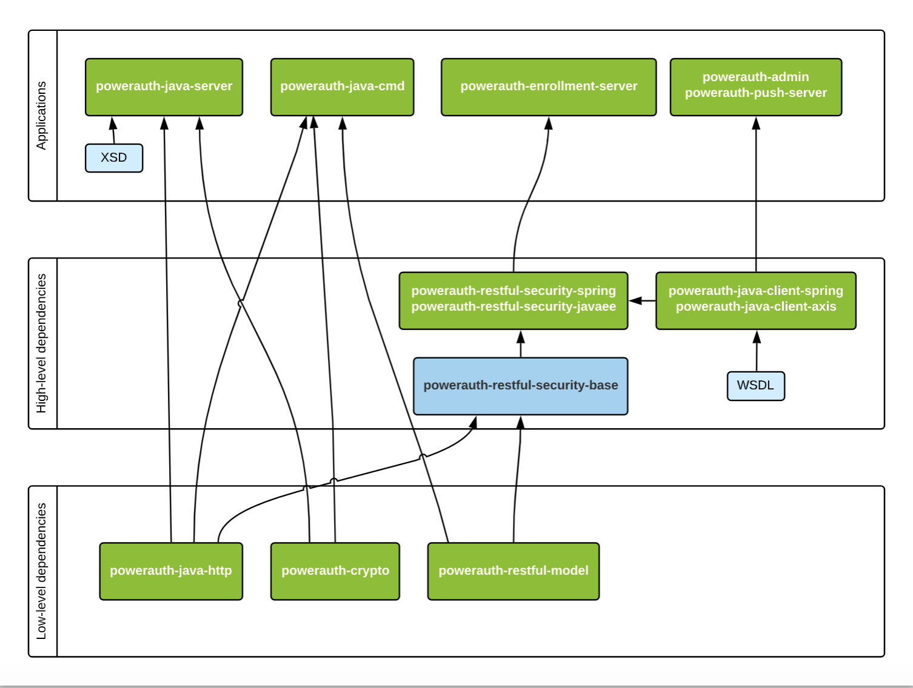

# Maven Modules

PowerAuth source code includes following Maven modules under a single parent project:

- `powerauth-java-prov` - A technical module exporting an interface for a generic provider implementation. This is needed in order to be able to have the same cryptography module for Java SE / Java EE and Android (that requires SpongyCastle).
- `powerauth-java` - Module responsible for the PowerAuth cryptography implementation.
- `powerauth-java-http` - A simple utility module implementing HTTP support for PowerAuth.
- `powerauth-java-client` - A simple SOAP service client class module capable of connecting to a running instance of PowerAuth Server. This module is typically used to integrate with Master Front-End Application APIs, such as with internet banking application.
- `powerauth-java-cmd` - A command-line utility implementing a reference PowerAuth Client.
- `powerauth-java-server` - A server application implementing a PowerAuth Server. It is responsible for publishing PowerAuth Server SOAP methods and RESTful API, and also for persistence of the data in a database.
- `powerauth-android` - Module for implementing Android support of PowerAuth protocol (for implementing the PowerAuth Client).
- `powerauth-restful-model` - A simple module with the RESTful API model classes for PowerAuth Standard RESTful API requests and responses.
- `powerauth-restful-security` - A module used to integrate PowerAuth protocol in RESTful APIs. It includes PowerAuth Standard RESTful API controllers (and therefore publishes related endpoints), `PowerAuthAuthenticationProvider` that can be used to verify signatures, utilities for correct configuration, etc. This module is typically used to integrate with Intermediate Server Application, such as mobile banking APIs.
- `powerauth-restful-server` - A simple implementation of the RESTful API publishing the PowerAuth Standard RESTful API.

Maven modules have following dependencies:

