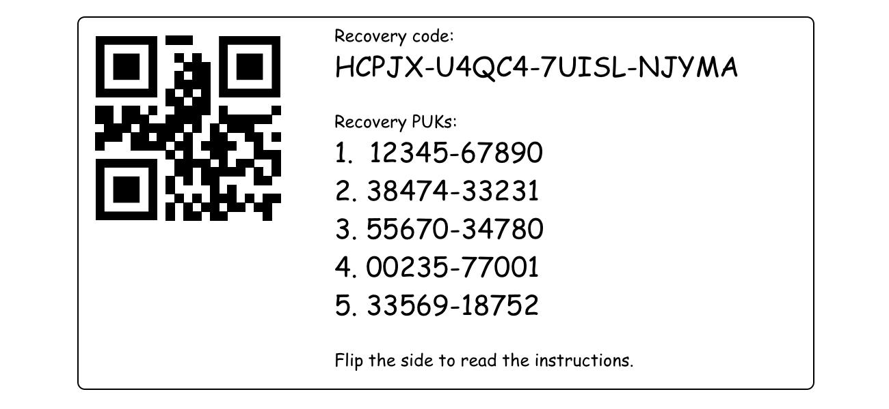
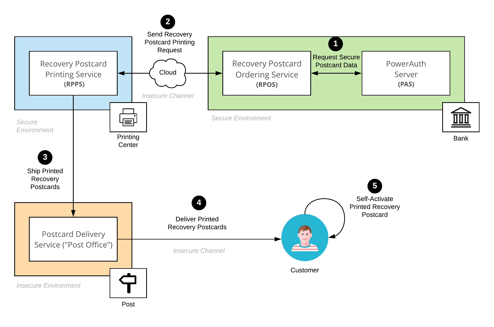

# Recovery Postcard

The Recovery Postcard is a postcard delivered via OOB channel (typically via the courier service) which contains information needed for the PowerAuth Client's [activation recovery](Activation-Recovery.md). This document describes, in brief, the format of the postcard and the process required for its construction.

## Information printed on the postcard

The Recovery Postcard typically contains the following information:

- One "Recovery Code", printed as a human readable string
- One "Recovery QR Code" with encoded "Recovery Code".
- Multiple PUK codes with its indexes, printed in order that user should use them.
- A brief information about how to use the postcard.

For example:



## Recovery Postcard Construction

The purpose of this section is to describe how the postcard is securely exchanged between PowerAuth Server and the recovery postcard printing service. The following abbreviations will be used in this section:

- **"PAS"** – stands for PowerAuth Server
- **"RPPS"** – stands for "Recovery Postcard Printing Service". It's a service responsible for the postcard manufacturing.
- **"RPOS"** – stands for "Recovery Postcard Ordering Service". It's a service that orchestrates a whole process, from postcard issue, to send order to RPPS



### Introduction to the problem

1. The PowerAuth Server is typically located in a controlled and very secure environment in the bank
2. On opposite to that, the Printing Service responsible for Recovery Postcard manufacturing, is typically located outside of the bank.
   - It's expected that the service has also some level of physical security (e.g. 24/7 security cameras), operator in factory has no physical access to the printer or the computer.
3. We don't want to transmit recovery codes in plaintext (or even encrypted with the pre-shared key)


### Printing order

1. PAS and RPPS must have pre-shared asymmetric EC keys (P256r1), leading to 32bytes long shared secret (ECDH). Let's call this as `RPPS_MASTER_SHARED_SECRET`.

1. RPOS asks PAS for postcard creation for one particular user

1. PAS will calculate
   ```java
   byte[] SHARED_SECRET
   if (RPPS_MASTER_SHARED_SECRET == null) {
       // Mode useful for RC associated with activation
       SHARED_SECRET = Generator.randomBytes(32)
   } else {
       // Mode useful for RC postcard creation
       SHARED_SECRET = RPPS_MASTER_SHARED_SECRET
   }

   repeat
   {
       byte[] NONCE = Generator.randomBytes(32)
       byte[] SHARED_POSTCARD = KDF_X9_63_SHA256.derive(SHARED_SECRET, NONCE)
       byte[] RECOVERY_CODE_BYTES = ByteUtils.subarray(SHARED_POSTCARD, 0, 10)
       String RECOVERY_CODE = Generator.buildActivationCode(RECOVERY_CODE_BYTES)
       if RECOVERY_CODE doesn't exist in DB {
           break
       }
   }

   byte[] RECOVERY_PUK_BASE_KEY = ByteUtils.subarray(SHARED_POSTCARD, 10, 16)

   // Prepare array of PUK derivation indexes, set to 0
   long[] PUK_DERIVATION_INDEX_ARRAY[PUK_COUNT] = { 0 }

   // Prepare array of PUK values
   String[] PUK_ARRAY[PUK_COUNT] = { null }

   for I = 0; I < PUK_COUNT; i++
   {
       repeat
       {
           long PUK_DERIVATION_INDEX = ByteUtils.getLong(Generator.randomBytes(8))
           byte[] PUK_KEY = KDF.derive(RECOVERY_PUK_BASE_KEY, PUK_DERIVATION_INDEX)
           long PUK_VALUE = (ByteUtils.getLong(ByteUtils.truncate(PUK_KEY, 8)) & 0xFFFFFFFFFFL) % Math.pow(10,10)
           String PUK = String.format("%010d", PUK_VALUE)
           if  !PUK_ARRAY.contains(PUK) {
               PUK_DERIVATION_INDEX_ARRAY[i] = PUK_DERIVATION_INDEX
               PUK_ARRAY[i] = PUK
               break
           }
       }   
   }
   ```

1. PAS store following values to the database:
    - `RECOVERY_CODE`
    - For each value in `PUK_ARRAY` stores argon2 hashed value

1. PAS will return following values to RPOS
    - `NONCE`
    - `PUK_DERIVATION_INDEX_ARRAY`

1. RPOS will construct printing request for RPPS:
   ```json
   {
      "bankClient": {
          "gender": "M",
          "fullName": "Franta Novák",
          "company": "Wultra s.r.o.",
          "streetName": "Budějovická",
          "streetNumber": "779/3a",
          "city": "Praha 4",
          "zip": "14000",
          "country": "CZ"
      },
      "postcard": {
          "identifier": "SOME-ISSUE-IDENTIFIER",
          "nonce": "32bytes, encoded in BASE64",
          "pukDerivationIndexes": [
                323213,
                123123,
                535,
                31329854,
                432432
          ]
      }
   }
   ```
   _Note that the JSON structure above is just an example to illustrate how nonce and PUK derivation indexes may be passed with a permanent address of a recovery postcard recipient. The actual payload format may be slightly different for different business purposes._

1. RPPS knows `RPPS_MASTER_SHARED_SECRET`, so it can reconstruct `RECOVERY_CODE` and `PUK` values from the received printing request:
   ```java
   byte[] SHARED_POSTCARD = KDF_X9_63_SHA256.derive(RPPS_MASTER_SHARED_SECRET, NONCE)
   byte[] RECOVERY_CODE_BYTES = ByteUtils.subarray(SHARED_POSTCARD, 0, 10)
   String RECOVERY_CODE = Generator.buildActivationCode(RECOVERY_CODE_BYTES)

   byte[] RECOVERY_PUK_BASE_KEY = ByteUtils.subarray(SHARED_POSTCARD, 10, 16)

   // Prepare array of PUK values
   String[] PUK_ARRAY[PUK_COUNT] = { null }

   for I = 0; I < PUK_COUNT; i++
   {
       long PUK_DERIVATION_INDEX = PUK_DERIVATION_INDEX_ARRAY[I]   
       byte[] PUK_KEY = KDF.derive(RECOVERY_PUK_BASE_KEY, PUK_DERIVATION_INDEX)
       long PUK = (ByteUtils.getLong(ByteUtils.truncate(PUK_KEY, 8)) & 0xFFFFFFFFFF) % Math.pow(10,10)
       PUK_ARRAY[i] = String.format("%010d", PUK)
   }
   ```

1. All parts involved in the scheme must forget `NONCE` and `PUK_DERIVATION_INDEX_ARRAY`. The values must not be stored in the persistent storage, should not be put into the log file, etc.
